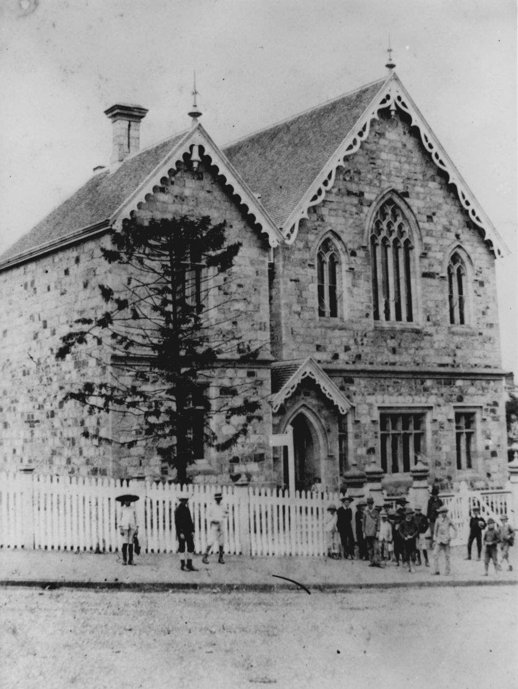
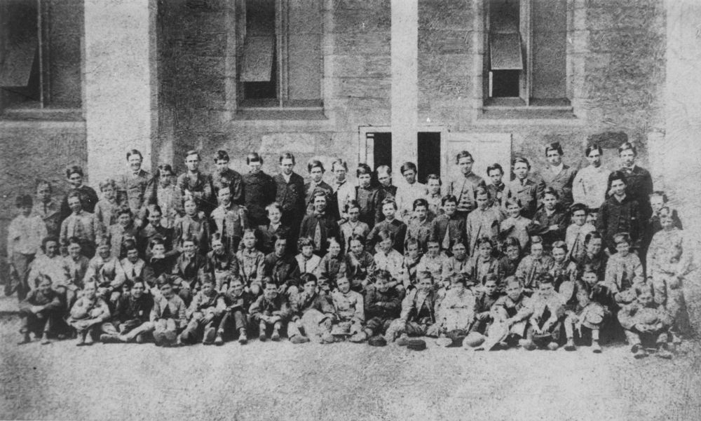

John Wood Rendall was born in Upper Inkster, Orkney Islands, Scotland, to Peter Rendall and Jane Wood, who were small farmers.

In 1846 he left for the Portuguese colony of Azores, where he was employed as tutor of languages, to the Governor's children. There he met Letitia Amelia Hewitt, a ward of the Governor. Letitia Amelia's mother and the Governor's wife were friends and Amelia (as she was later known) had been sent for health reasons from her home in Worcester, England, arriving the same year as John. She was born in 1829 to Joseph Hewitt and Mary Harris.

John Rendall and Amelia Hewitt were married by the Chaplain of the British Protestant Church, City of Ponta Delgarda, Island of St. Michael, on the 13^th^ of June 1819.

One year later, also in Ponto Delgarda, Amelia's mother married for the second time to a Portuguese, Emmanuel Inez Rodrigues[^1]. When she was widowed again, Mary emigrated to join her daughter, who by this time was in Brisbane. Mary arrived on the 7^th^ of January 1877. She had been there only seven years when she died in 1883. As well as Amelia, she had a surviving son, Joseph, and a deceased girl from each of her marriages.

Meanwhile, back in the Azores, John and Amelia had two sons, Joseph Hewitt, born on the 24^th^ of April 1859 and Henry Hewitt, born on the 15^th^ of September 1851. (All their children were given the name 'Hewitt'.)

Eight years after their arrival in the Azores, they returned to England, to embark on the *Calphumia* which sailed for Australia on the 5^th^ May 1853. Amelia was pregnant with their third child, Mary Jane Hewitt, who was born on board the ship in Melbourne Harbour on the 19^th^ of August 1853. They continued on to Sydney, where John's first teaching post was Campsie, now Trevellyn in the Hunter Valley. He opened the school there in October. He was well regarded; an Inspector recorded that "*his teaching was very superior.*" Their fourth child, John Hewitt, was born at nearby Paterson on the 11^th^ of September 1855.

John was transferred to Drayton, near Toowoomba, in August 1856. They were at Drayton for three years until Queensland separated from New South Wales in 1859. Ellen Hewitt was born there on the 20^th^ of October 1858. A son, Nugent, had been born and died the year before.

The high standard of John's teaching was recognised at this school also. Before he left, a public testimonial described him as "*as one of the most able teachers in Queensland.*"

Following Separation John was appointed the first headmaster of the newly built Normal School, making him the first Headmaster of the first State School in the new state of Queensland. It opened on the 2^nd^ of April 1860 and John remained there till his death on 27^th^ of November 1873, aged 45 years of age.

Amelia was left with ten children, five more being born at *Moorlands Villa*, on the site of what is now the Wesley Hospital. They were Letitia Amelia Hewitt, October 1860, Frank Hewitt, August 1862, Anne Hewitt, July 1864, Florence Hewitt, January 1866 and Charles Hewitt, December 1868. 

Throughout his career John attracted official praise for his teaching, discipline and approachability, and he made an indelible mark on Queensland's educational history. The pupil-teacher training system was inaugurated under his direction.

In March 1872 "*after 14 years unremitting mental labour which severely taxed his constitution,*" he became Acting Inspector of the Northern Districts examining all the primary schools north of Brisbane as far as Cardwell.

He returned to the Normal School in September of that year and shortly afterwards was presented with a beautiful timepiece, as a testimony to his worth and ability. The inscription on a silver plate attached to the front of the clock reads: "*Presented to John Rendall, Esq. By the teachers and pupils of the Normal School, Brisbane 1873*". It is now in the possession of John's great-grandson.

John took leave of absence and after an illness of two weeks, the last five days of which he was in severe pain, he died at his home *Moorlands Villa* on the 27^th^ of November, 1873. The school was closed for the rest of the week as a mark of respect and teachers and pupils alike "*were cast into gloom*".

{ width="30.7%" } { width="68%" }

*<small>[Normal School, Brisbane, ca. 1885](http://onesearch.slq.qld.gov.au/permalink/f/1upgmng/slq_alma21218209230002061) — State Library of Queensland.</small>*  
*<small>[Students from the Normal School, Brisbane, ca. 1872](http://onesearch.slq.qld.gov.au/permalink/f/1upgmng/slq_alma21219131300002061) — State Library of Queensland.</small>*

A monument to his memory was erected over his grave by pupils and friends connected with the public schools in Brisbane.

He was buried in the Presbyterian Cemetery at Paddington, Brisbane. After it was closed it fell into disrepair. In 1911 an Act of Parliament enabled the resumption of such cemeteries and allowed them to be redesignated for public use. Relatives had twelve months to arrange for re-interment. John was re-interred in Toowong Cemetery on the 16^th^ of May 1913.

A plaque enclosed in three stones from the old Normal School is incorporated in the wall of Anzac Square Building, Edward Street, Brisbane, commemorating the school and John Rendall's association with it.

John and Amelia were caring persons, sympathetic to the needs of those worse off than themselves. During the financial crash of 1866 when government funds were cut off, they fed many people who came to them for help with milk from their cow and a bowl of potatoes on their front lawn, although being almost as impoverished themselves.

John, with another teacher, Randall MacDonnell, intervened with the Government on behalf of such starving people to get them some relief. He was also a guiding force in the effort to establish a Teachers Union. John was very tolerant in regard to religion.

Following John's death, Amelia and her family supported themselves by operating a series of boarding houses, one of which, *Cadarga*, was in Milton. Following this she had premises in Gregory Terrace, *Holyrood*, later owned by the Country Women's Association.

Amelia lived to the ripe old age of 93, spry to the last, and living to see the birth of the first of her great-grandchildren.

### Acknowledgement

This story was contributed by Ruth Inglis.

[^1]: Mary Ann Rodrigues is recorded as 'Mary Ann Rodriques' in the [Brisbane City Council Cemeteries Search](https://graves.brisbane.qld.gov.au)
