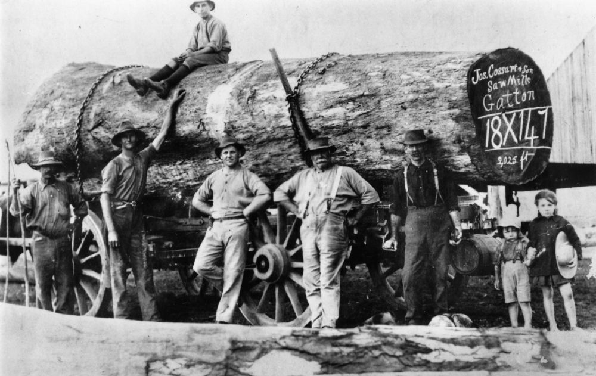

## Joseph Cossart <small>(13‑18‑16)</small>

Joseph Cossart was born on 14 November 1843 (± 3 years) in County Antrim, Ireland to Henry Cossart and Mary (née Walker). The family sailed from London to Moreton Bay aboard the *Flying Cloud*, arriving on 19 February 1864. The family settled in the Perseverance Creek district. 

Annie Bidgood married Joseph in Pipe Clay, Perseverance near Crow's Nest, Queensland on 4 August 1874. They had nine children.
In 1890 Joseph moved his family to the Dugandan district near Boonah, where they lived until moving to Brisbane in 1899.

In 1901, Joseph and Sydney, his second son, started a saw milling business in Gatton. Ultimately Joseph's other sons joined the business.
Joseph died at his residence, *Babbiloora*, Browne Street, New Farm on the evening of 25 December 1911 leaving his widow, four sons and four daughters.

{ width="60%" }  

*<small>[Log felled in the Gatton district, Queensland](http://onesearch.slq.qld.gov.au/permalink/f/1upgmng/slq_alma21219240550002061). Log labelled Jos Cossart & Son Sawmills, Gatton — State Library of Queensland.</small>*
