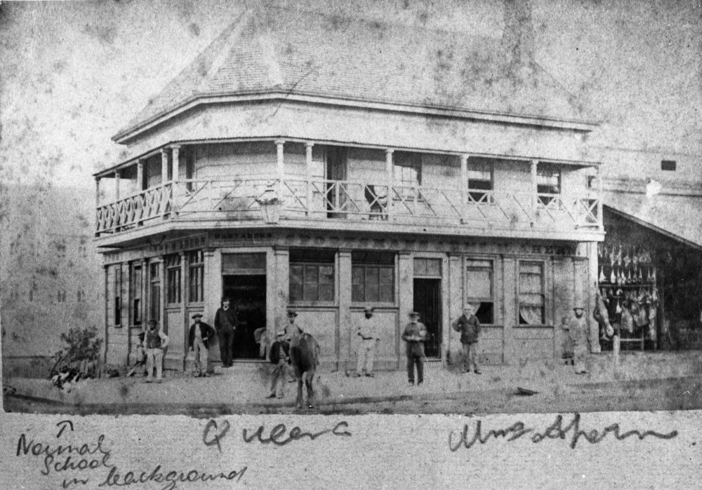

## Joseph Darragh <small>(7‑27‑11)</small> 

Born 1828 in Tyrone, the son of Joseph and Ann (1803‑1883), Darragh arrived in Sydney on 29 April 1850 with his wife, Eliza Grimes They moved to Brisbane where he was a butcher at Kangaroo Point from 1853 to 1902. Darragh Street was named for the family before 1874, and when he died, Darragh was ‘of Independent Means’. 

Darragh’s brothers were also businessmen in Brisbane. James (1831‑1905) was a publican of the Logan Hotel, Main St, Kangaroo Point and the Sportsman’s Arms in Queen St, while Hugh (1839—1916) was also a butcher. Joseph died in 1902.

{ width="70%" }  

*<small>[Sportsman's Arms Hotel, Brisbane, ca. 1874](http://onesearch.slq.qld.gov.au/permalink/f/1upgmng/slq_alma21257614520002061) — State Library of Queensland.</small>*
