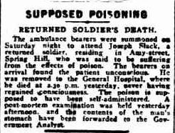

## Joseph Slack <small>[(10‑39‑2)](https://brisbane.discovereverafter.com/profile/31838144 "Go to Memorial Information" )</small>

Joseph enlisted aged 44 in October in 1914 and was a Corporal in the 15^th^ Battalion, awarded the Military Medal. His service record includes the following:

- 20.5.1915 Wounded in action in Gallipoli
- 14.8.1915 GSW left shoulder
- 16.8.1915 Wounded in action again, GSW right arm, admitted to hospital
- 19.9.1915 Admitted to hospital
- 24.10.1915 Admitted to hospital with dysentery
- 25.10.1915 Quinine poisoning following treatment for malaria, general debility
- 30.10.1915 Dysentery, admitted hospital
- 11.1.1916 Dysentery
- 1.2.1916 GSW serious, admitted hospital
- 2.3.1916 GSW thorax, invalided to Australia

His file states his pension was reduced in 1918 from £2 to £1 per fortnight. 
 
==Insert image and [attribution](https://anzacportal.dva.gov.au/wars-and-missions/ww1/where-australians-served/gallipoli/timeline)==

??? warning "Gruesome details"

    On the 1^st^ March 1919 Joseph was robbed of £17 by 3 men who went to court for their crimes. Then on 23^rd^ March 1919, a little over 3 weeks later, Joseph died by suicide after drinking poison. 

    { width="60%" class="full-width" } 

    *<small>SUPPOSED POISONING (1919, March 24). Daily Standard (Brisbane, Qld. : 1912 - 1936), p. 6 (SECOND EDITION). Retrieved March 7, 2025, from [http://nla.gov.au/nla.news-article179827445](http://nla.gov.au/nla.news-article179827445)</small>*
    

As he is considered to have died ‘on service’ (i.e. he died before 31 March 1921) he will be awarded an official war grave. 

==Insert image and attribution==

