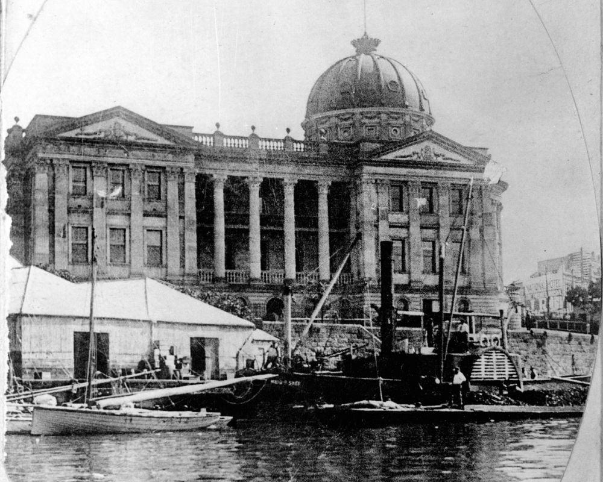

## Joseph William Sutton <small>(13‑7‑13/14)</small>

Joseph, who established the shipbuilding firm J W Sutton & Co at Kangaroo Point , was recognised as one of the leading engineers of his day. Early vessels built by J W Sutton & Co include the iron steamer, *Lady Musgrave*, the iron paddle steamer, *Maid of Sker*, and the first ferry boat used on the Brisbane River, the *Transit*. The home of Joseph and his wife, Mary was one of the first private residences in Brisbane to be lit up by electricity. Joseph died on 21 February 1914. 

{ width="70%" }  

*<small>[Ship 'Maid of Sker' anchored in the Brisbane River outside of the Customs House, Queensland](http://onesearch.slq.qld.gov.au/permalink/f/1upgmng/slq_alma21256762780002061). Cropped. — State Library of Queensland.</small>*
