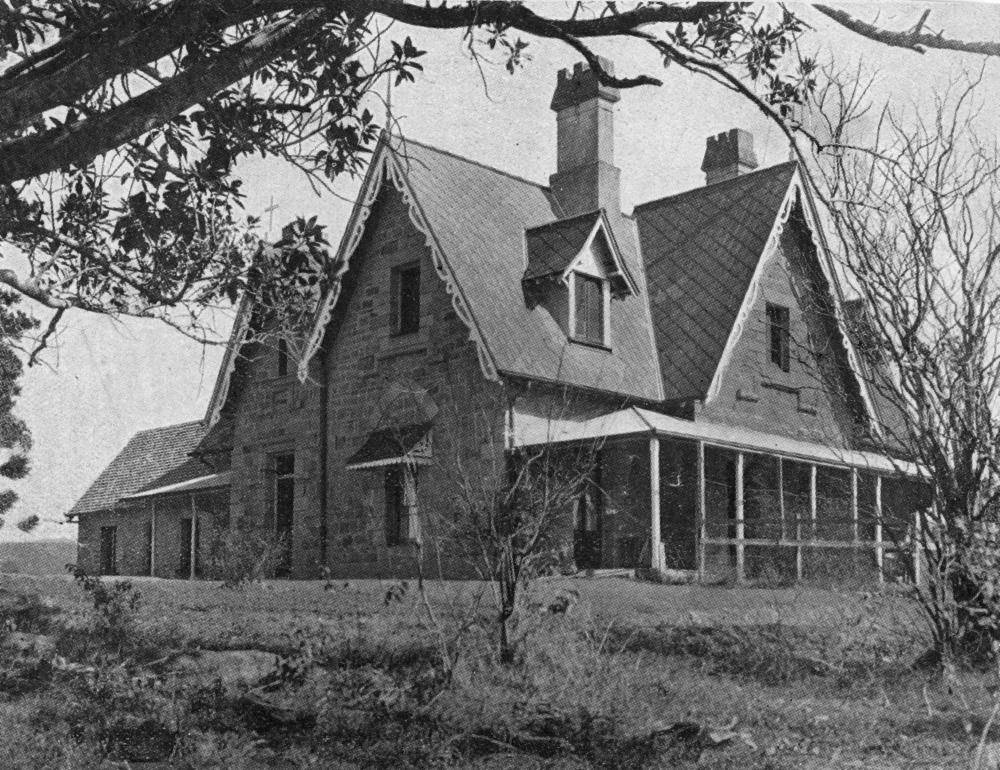
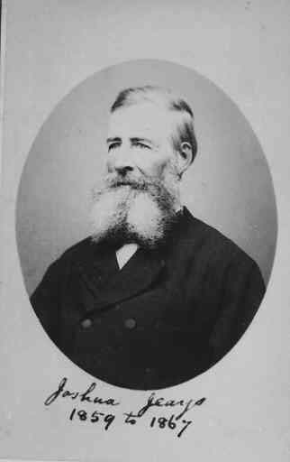

## Joshua Jeays <small>(13‑62‑13)</small>

The third Mayor of Brisbane, Joshua Jeays died on the 11 March 1881 aged 69. He was born in Leicestershire, 1812. He married Sarah Edwyn in 1838 in Marylebone, Middlesex. They and their three children immigrated to Moreton Bay in 1853. His daughter Sarah Jane married in 1858 in Brisbane to Sir Charles Lilley, who became Premier of Queensland. 

In 1862, Joshua Jeays bought 39 acres at the corner of Cooper's Camp Road on which he built Bardon House. He is buried with his wife Sarah who predeceased him, dying on 26 July 1864 in Brisbane. Sarah was originally buried in Paddington Cemetery but re‑interred in here on 17 April 1913. 

Joshua built homes of prominent Brisbane residents such as John Petrie and the Cribb family. Joshua was an Alderman from 1859 to 1867 and was Mayor in 1864.

{ width="62%" }  { width="30%" } 

*<small>[Bardon House in Brisbane, ca. 1930](http://onesearch.slq.qld.gov.au/permalink/f/1upgmng/slq_digitool166099) Bardon the suburb was named after this home built by Joshua Jeays, one of the first landowners in the district. The area was first surveyed in 1862. Jeays was the home owner and architect and a business partner of Andrew Petrie. — State Library of Queensland.</small>*  
*<small>[Alderman Joshua Jeays](https://library-brisbane.ent.sirsidynix.net.au/client/en_AU/BrisbaneImages/search/results?qu=Alderman+Joshua+Jeays&rm=BRISBANEIMAGES0%7C%7C%7C1%7C%7C%7C0%7C%7C%7Ctrue&te=ASSET&lm=ALL_ASSETS) — Brisbane City Council.</small>*
