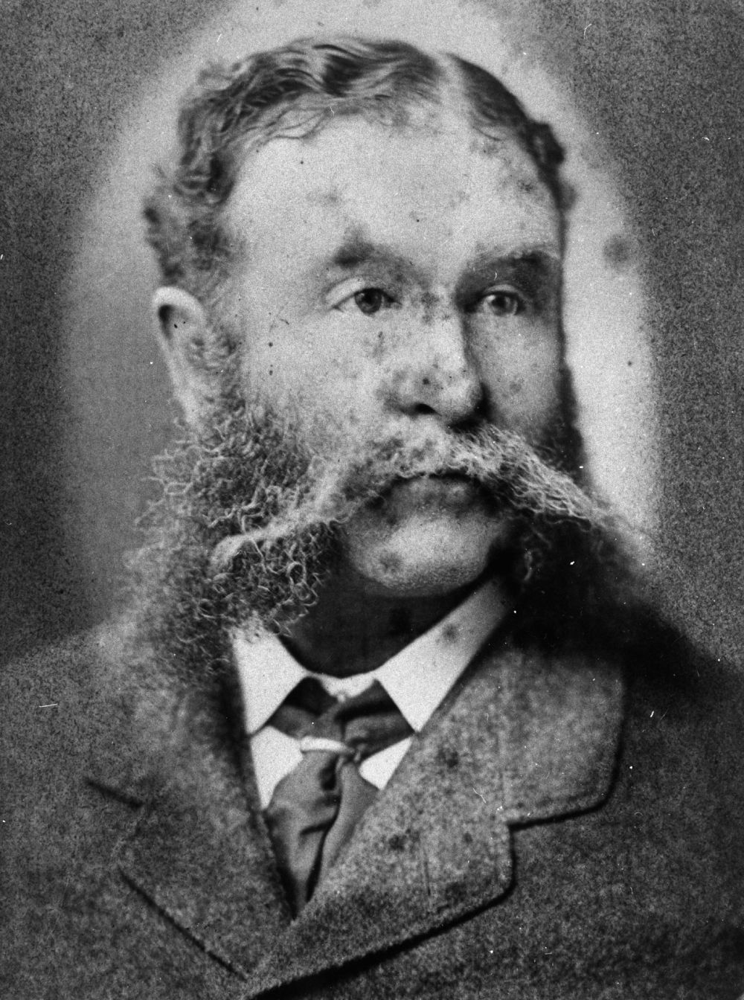

## Hon. Joshua Peter Bell <small>(13‑84‑8)</small>

Administrator – 19 March 1880 to 22 November 1880

Bell was born on 19 January 1827 in Kildare, Ireland, the eldest son of Thomas Bell and his wife Sarah, née Alexander. When aged about three, his parents migrated to Australia. He was educated in Sydney then entering the office of a Sydney solicitor. In 1843 his father took over the pastoral lease of *[Jimbour](https://jimbour.com/history/)* near Dalby which Bell took control aged 21. 

In 1859 was invited to stand for West Moreton. On 19 February 1861 at Ipswich he married Margaret Dorsey. In December 1862 he was returned with a large majority. In June 1863 after the dissolution of the first parliament he was returned for the same electorate. In December 1864 he became treasurer in the Herbert ministry. On Herbert's temporary retirement in 1865 Bell retained office in the Macalister ministry, being Treasurer when the financial crisis of 1866 struck the colony. In 1866 Bell became acting Minister for Lands and in 1867 acting Minister for Works. 

In 1868 he was returned for Northern Downs and held the seat until he was appointed President of the Legislative Council in 1879. From 19 March to 20 December 1880 he acted as Administrator of the colony when Governor Sir Arthur Kennedy was on leave. On 20 December 1881, while returning from a business appointment in a cab, he died unexpectedly.

{ width="40%" }

*<small>[Sir Joshua Peter Bell](http://onesearch.slq.qld.gov.au/permalink/f/1upgmng/slq_alma21219246370002061) - State Library of Queensland </small>*
