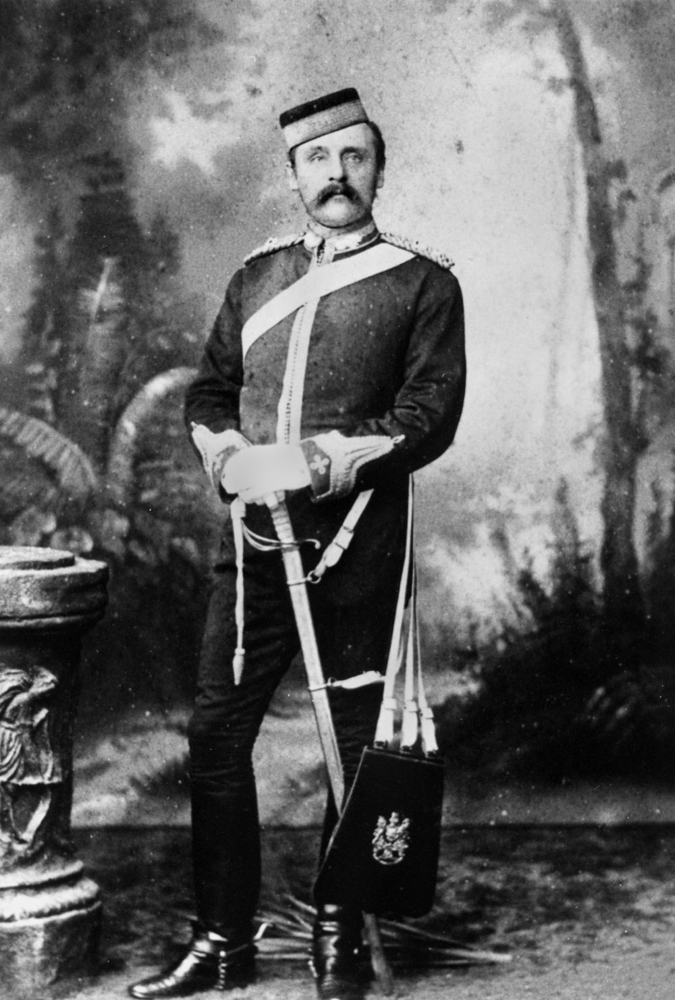

## Justin Fox Greenlaw Foxton <small>(1‑114‑7/8)</small>

Justin Fox Greenlaw Foxton, was born on 24 September 1849 in Melbourne, son of Captain John Greenlaw Foxton and his wife Isabel Elizabeth, née Potts. In 1864 he moved to Queensland where he was articled to James Malbon Thompson in Ipswich and admitted to the Bar in 1871. 

Foxton held the Legislative Assembly seat of Carnarvon from 1883 until 1904 when he refused to support the Morgan coalition. As Home Secretary under the Philp government, Foxton introduced the Adult Suffrage Bill in 1901. Foxton died of cerebro-vascular disease at South Brisbane on 23 June 1916.

{ width="40%" }  

*<small>[Major Justin Fox Greenlaw Foxton of the Brisbane Field Artillery, 1888](http://onesearch.slq.qld.gov.au/permalink/f/1upgmng/slq_alma21218246210002061) — State Library of Queensland.</small>*
