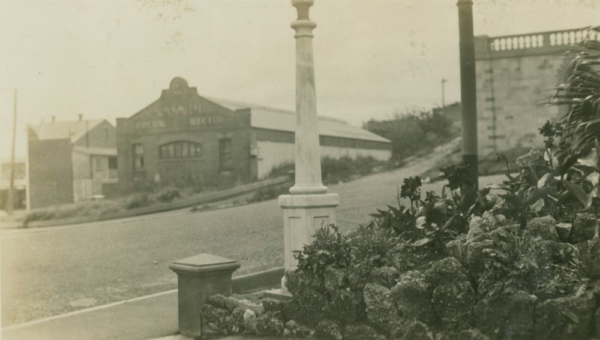

## Kate Mary Smith <small>(1‑7‑14)</small>

Kate Mary Smith, giving her name to the [KM Smith Funerals](https://kmsmith.com.au/our-services/our-family-history/), was a true pioneer in an era when women pursued domestic duties or worked in service or in factories. Born in Ireland in 1847 as Catherine Mary Farrell, she immigrated to Australia with her brother in the 1860s. Kate Farrell is believed to have worked for the Jardine family on Cape York. Certainly she was at Somerset on 27 January 1868 when she married Marine John Smith at the Registrar’s Office. Their marriage certificate shows John was 29, and a piano forte maker like his father; Kate was 21 and described herself as a servant. 

Kate Mary, a Catholic, and her Anglican husband John, arrived in Brisbane in 1874. Through their respective churches and his Freemasonry, they were able to make extensive social and business connections, despite living in poor circumstances themselves. John often applied his cabinet making and carpentry skills to produce coffins, subsequently becoming an undertaker. They lived in Peel Street, South Brisbane, and later at Manning Street, and bought the undertaking business of William Walsh in 1883. They operated for many years from George Street, just near the old Lands Department, and they competed for business with other undertakers such as Walter Barrett and the Hislops. Two years later John Smith was dealing with his solicitors about leasing land at the corner of Wickham and Gotha Streets, below the steep hill crowned by All Hallows. 

On 11 January 1886, the Smith family moved from South Brisbane to the Valley where they lived in the upper storey, above the business. Nearby were the very necessary stables, housing the hearses and the black horses that drew them. It was a many-faceted business, and they were on call day and night. But Kate Mary's husband was ill, suffering from consumption, and weakened by an attack on the Marines at Somerset in 1864 in which he had suffered two spear wounds, serious enough for him to have been sent to Sydney for some months. A few months later he died, at Wickham Street, aged 42, and was buried by a Church of England minister at Toowong on 20 May 1886. Kate Mary had run the business for some time already, assisted by her eldest son, John. She had learned how to embalm, a necessary skill to enable the transportation of bodies, but a rare one for a woman to master. This was especially remarkable as women of the time rarely attended funerals let alone work in the industry. She closely monitored all aspects of its operations and insisted on quality service.

The company continued to develop as times changed, and was an early mover from horse drawn hearses to motor vehicles completing the process in 1932. Kate Mary was a generous supporter of the church and the Mater hospital. Strong and determined, she has been described as a feisty woman who did not suffer fools gladly. These qualities saw the company flourish, despite the hardships of World War One and the depression. Personal tragedy also continued to strike, by the time of her death in June 1932 aged 85, Kate Mary had buried four of her six children.

{ width="70%" }

*<small>[Looking from Centenary Place across Gotha St, Fortitude Valley towards K.M. Smith Funeral Directors](http://onesearch.slq.qld.gov.au/permalink/f/1upgmng/slq_alma21276483100002061) - State Library Queensland. </small>*
