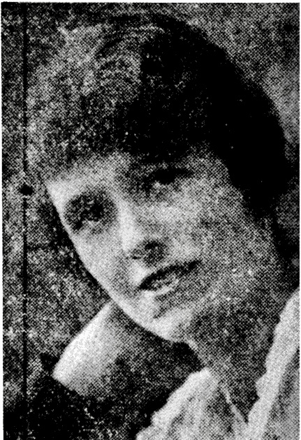

## Kathleen Eileen Sheehy <small>(7A‑135‑12)</small>

Kathleen Eileen Sheehy was born on 4 November 1892 at Gympie, the second of six children of Irish-born parents. She was the sister of Sir Joseph Sheehy KBE who served as Senior Puisne Judge of the Queensland Supreme Court and Administrator of the State of Queensland for three months in 1969 and Sir Christopher Sheehy, dairy industry administrator and public servant.

Kathleen joined the State teaching service in 1912. Following appointments at various schools throughout Queensland, Kathleen was appointed teacher-in-charge of the ‘backward’ classes at South Brisbane Boys’ School. In 1926 she recommended that these classes be referred to as ‘opportunity’ classes rather than ‘backward’ and her commendation was accepted by the Education Office in July that year. In 1935, the Dutton Park Opportunity School which catered for both boys and girls opened as the first of its type in this State with Kathleen Sheehy as teacher and three female assistants.

Kathleen retired at the end of the 1958 school year. She died on 22 April 1981 and was buried with Catholic rites in the family grave in Toowong Cemetery.

<figure markdown>
  { width="30%" class="full-width" }
  <figcaption markdown>Kathleen Sheehy, first Head Teacher of the Dutton Park Opportunity School, in [Female teachers 1860–1983](https://education.qld.gov.au/about-us/history/chronology-of-education-in-queensland/female-teachers), p30 — © The State of Queensland (Department of Education).</figcaption>
</figure>