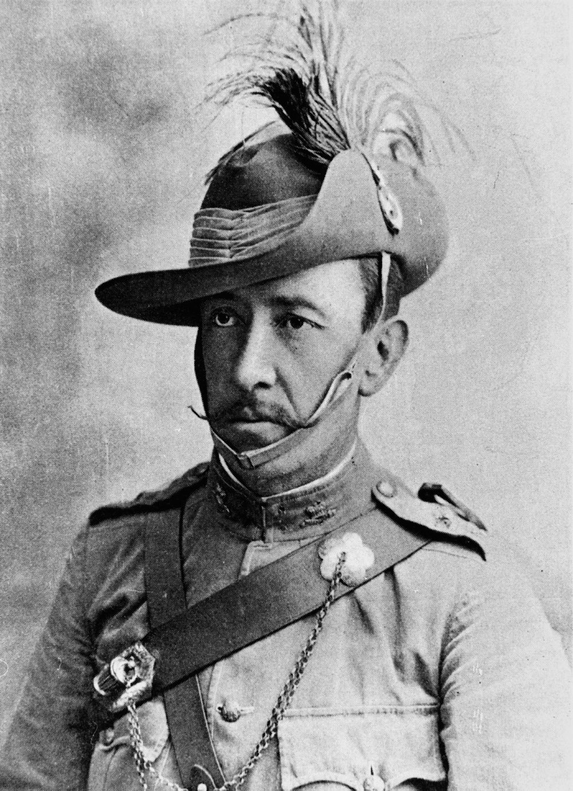

## Lt Col Kenneth Hutchison <small>(13‑82‑6)</small>

The son of a squatter, Peter Hutchison and his wife, Mary Ann (née Ronald), Kenneth Hutchison (ca. 1850-1902) was born in Victoria. When a young adult, he became a part owner with his brother and step-father in the historic Canning Downs pastoral property outside Warwick. 

He joined the Queensland Defence Force and rose through the ranks. In 1888 he started the Darling Downs Mounted Infantry of which he was given command and was appointed to the permanent Military Forces in 1890. In mid-March 1891, as the Adjutant of the 4th Queensland or Darling Downs Regiment of the Queensland Defence Force, he was sent to Charleville in Command of the Southern and Western Districts. 

{ width="40%" }

*<small>[Lieutenant Colonel Ken Hutchison](http://onesearch.slq.qld.gov.au/permalink/f/1upgmng/slq_alma21298063000002061) -  State Library of Queensland</small>*
