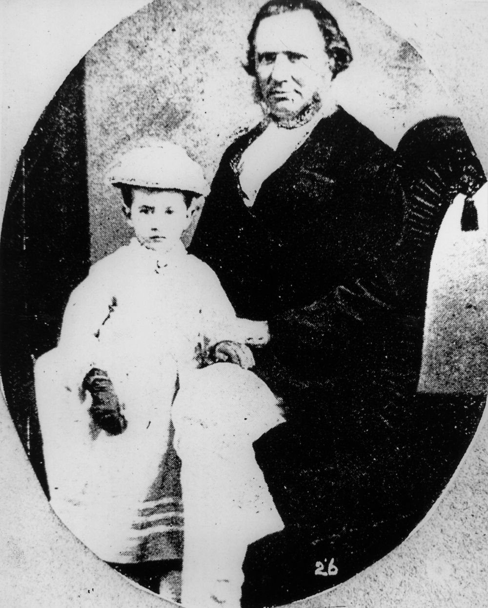
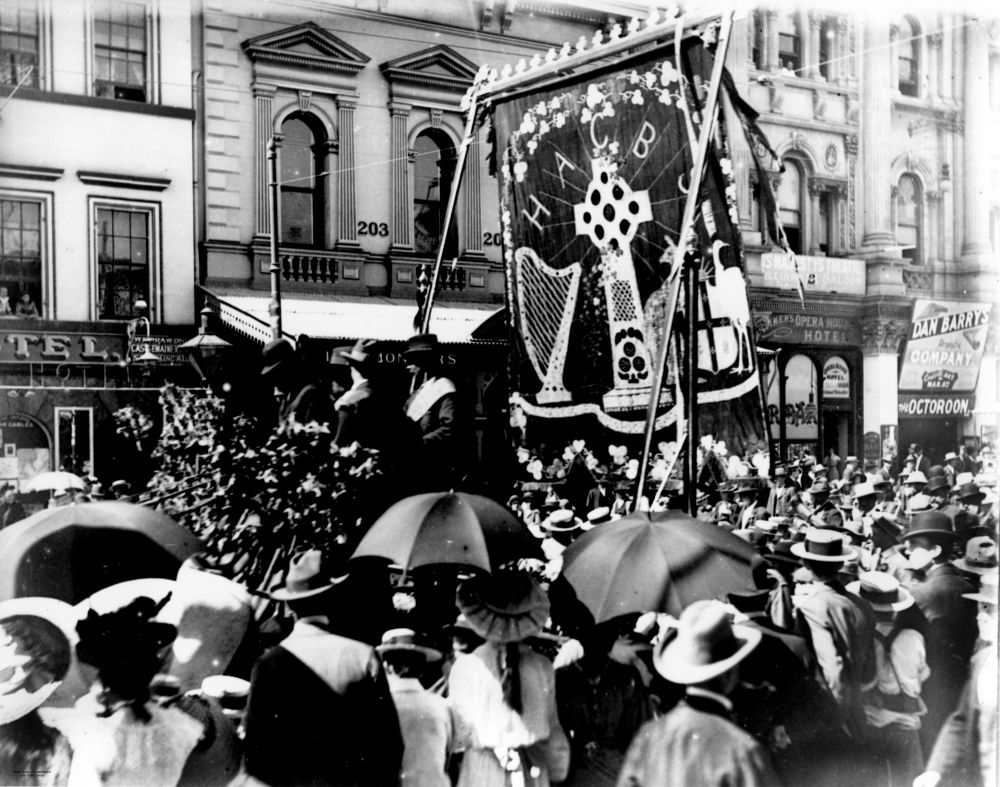

## Kevin Izod O’Doherty <small>(7‑58‑27)</small> 

O’Doherty was born in Dublin, son of solicitor William Dougherty and Anne McEvoy. He studied at the Catholic School of Medicine in 1844. He was convicted as a ‘Young Irelander’ and transported to Sydney in 1848 on the Mt Stewart Elphinstone and then on the Emma to Tasmania with fellow conspirators. After five years he was given a conditional pardon (not allowed to return to Ireland and went to Paris before marrying, in London, in 1855 writer Mary Eva Kelly of Galway (Eva of The Nation). Kevin and Mary are the subject of the book by Ross and Heather Patrick, *Exiles Undaunted*. In 1856 O’Doherty received a full pardon and went to Dublin to get his Medical Degree from 1857 to 1859.

They then migrated to Victoria in 1860 and to Brisbane where he set up practice in the Forbes Building at Ipswich in 1862. By 1866 he was the leading medical practitioner in George Street, Brisbane, and personal physician to Bishop Quinn. He was also the first President of the Queensland Medical Board. 

He was an MLA in 1867 and MLC 1877—1885 and also returned to Ireland as the Nationalist Member for Meath 1885—1888. As a founding member of the Queensland Hibernian Society and the Queensland Irish Association, O’Doherty was well respected and presided over the St. Patrick’s Day Committee in the 1860s. The Queensland Irish Association raised this monument over his grave.

{ width="35%" }  { width="55.1%" }  

*<small>[Doctor Kevin Izod O'Doherty (1823-1905)](http://onesearch.slq.qld.gov.au/permalink/f/1upgmng/slq_alma21218936000002061) — State Library of Queensland.</small>*  
*<small>[St. Patrick's Day procession, Queen Street, Brisbane, 1903](http://onesearch.slq.qld.gov.au/permalink/f/1upgmng/slq_alma21249906440002061) — State Library of Queensland.</small>*
