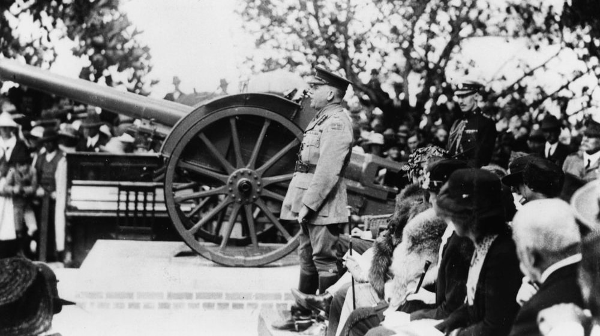

## Lachlan Chisholm Wilson <small>(8‑9‑1/2)</small> 

<!-- 1871‑1947 -->

[Lachlan Chisholm Wilson](https://adb.anu.edu.au/biography/wilson-lachlan-chisholm-9142/text16131) was born on 11 July 1871 at Logan River, Queensland. With the exception of Victoria Cross recipient, Charles Heaphy (1820‑1881, buried at Portion 1‑5‑34) he is the most decorated soldier in Toowong Cemetery.  

Educated at Brisbane Grammar School, Wilson began and ended his life as a lawyer, first admitted to the Queensland Bar in 1895. First practicing in Townsville, he later returned to Brisbane where he entered into a partnership with E. K. Tully to form one of Queensland's leading law firms. He later extended his business interests, becoming a director of the Australian Mutual Provident Society. During this time, he was also able to foster one of his personal interests, the welfare of ex‑servicemen and women, and cofounded Legacy. 

Aside from his work as a lawyer, Wilson also served his country, joining the Australian Imperial Force as a Major on 30 September 1914 and landing at Gallipoli in May. As the new commander, he mounted a successful raid against Bird Trenches near Gaba Tepe and seized positions now known as Wilson's Lookout. Taking part in almost all the major engagements between the Battle of Romani (3‑5 August 1916) and the capture of Damascus (October 1918), Wilson was also instrumental in introducing the Queensland spear‑point pump to obtain water in the desert. This portable device could raise water quickly and when combined with canvas troughs, simplified the watering of the horses.

Wilson continued his military service through Jordan and Egypt and notably managed a rebellion which broke out against the British. For his management of this conflict, Wilson was awarded the Distinguished Service Order and the French Croix de Guerre. After a brief period on the unattached list, Australian Military Forces, Wilson became aide‑de‑camp to the Governor‑General in 1923‑1927 and commander of a number of other infantry and cavalry brigades.

Wilson died at his New Farm home on 7 April 1947, survived by his wife, son and daughter.

{ width="90%" }

*<small>[Brigadier-General Lachlan Chisholm Wilson presenting a field gun at Brisbane Grammar School Queensland 1921](http://onesearch.slq.qld.gov.au/permalink/f/1upgmng/slq_alma21257852870002061) - State Library of Queensland. Cropped.</small>*
