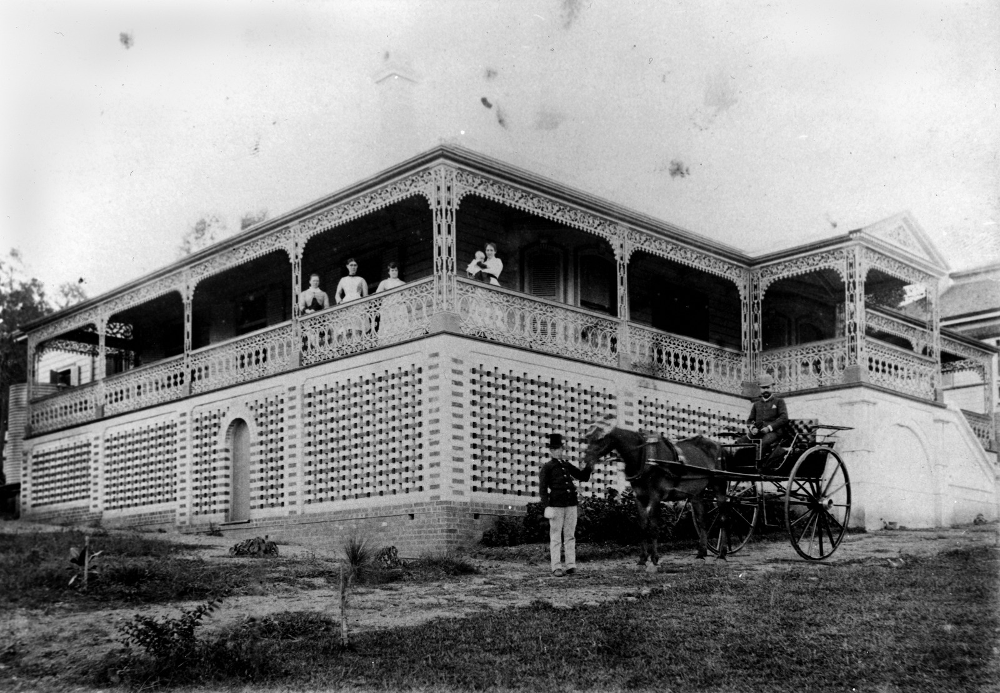

## Leila Elizabeth Perry <small>(11‑45‑4)</small>

Leila was the daughter of John Markwell and his wife, Georgina Edmondstone and the granddaughter of Hon George Edmondstone, one of the early pioneers of Brisbane. John Markwell was one of John Dunmore Lang’s immigrants who had arrived in Brisbane on the *Chasely* in 1850 and had involved himself in land speculation and several businesses in Brisbane. Leila was born on 24 January 1868 in *Moorlands Villa* on the property at Auchenflower where the Wesley Hospital now stands. On 29 September 1885, at St Andrew’s Church at Lutwyche Leila married
into another prosperous merchant family, the Perrys. Her husband, William Herbert Francis Perry was the eldest son of William Perry and Annie Harcourt.

Leila and her husband were frequently featured and cited in the social pages of the Brisbane newspapers. Leila died at her home *[Miegunyah](https://www.miegunyah.org)*, Jordan Terrace, Bowen Hills on 17 March 1920.

<figure markdown>
  { width="70%" class="full-width" }
  <figcaption markdown>[On the verandah at Miegunyah, a residence in Brisbane, 1886](https://onesearch.slq.qld.gov.au/permalink/61SLQ_INST/dls06p/alma99183513641502061) — State Library of Queensland.</figcaption>
</figure>