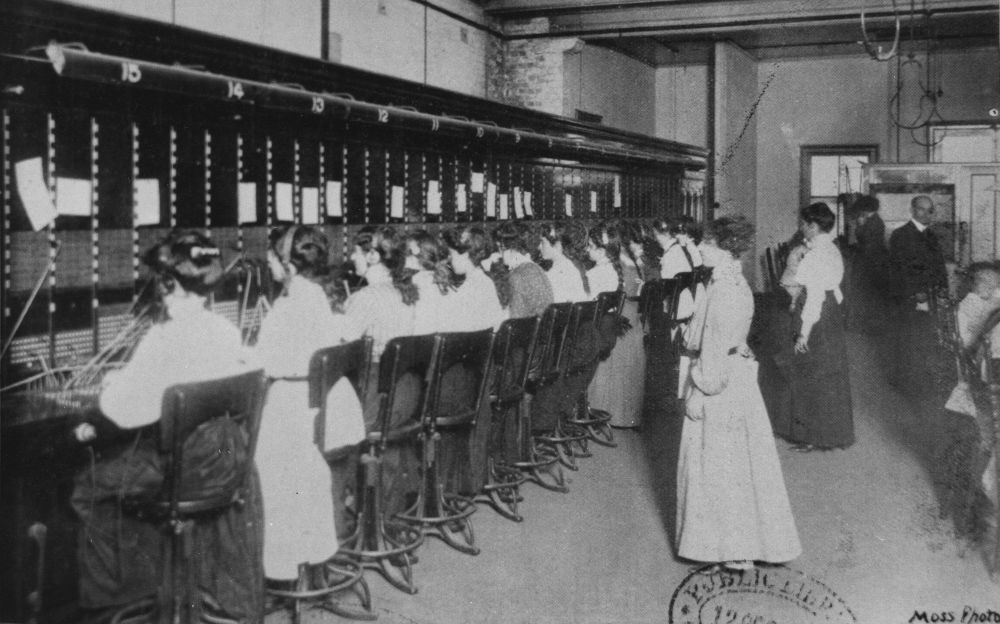
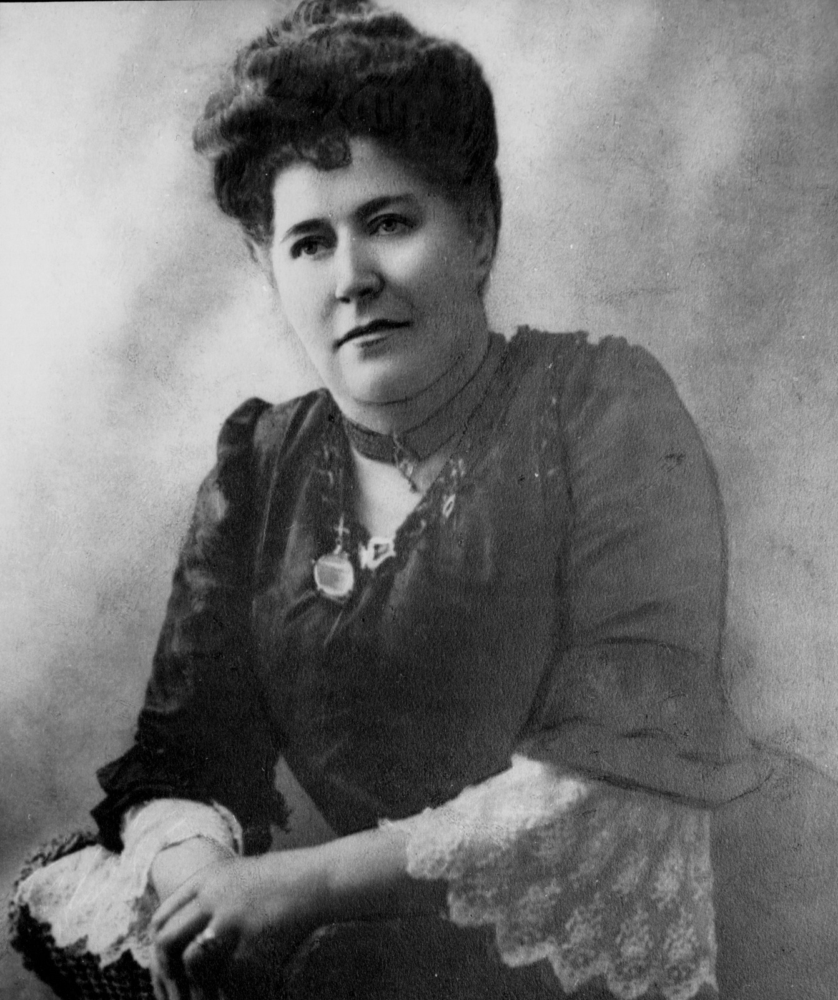

## Magdalene Dick <small>[(18‑35‑25)](https://brisbane.discovereverafter.com/profile/31872278 "Go to Memorial Information" )</small>

Magdalene Dick was born in Brecon, Wales around 1851. She was the daughter of David Price, a plumber, glazier and painter and his wife, Mary William or Williams. Magdalene came to Australia as a young girl and the family settled in Ballarat where she later married William Heddle Dick, a journalist who wrote for major newspapers in Sydney, Hobart and Brisbane and who established a penny newspaper in Toowong. Magdalene was also a journalist and sister of Thomas Evan Price who was the social and drama critic of the Sydney Morning Herald. 

After William’s death [Magdalene became superintendent of the first group of female switchboard operators at the Brisbane telephone exchange](https://trove.nla.gov.au/newspaper/article/20560715).

  { width="60%" } { width="31.4%" }

  <small>[Telephonists working at the Brisbane Central telephone exchange, Brisbane, 1910](https://onesearch.slq.qld.gov.au/permalink/61SLQ_INST/bumb4u/alma99184003680302061) — State Library of Queensland. 
  [Mrs William Heddle Dick, First Lady Superintendent of the First Telephone Exchange in the Colony of Queensland](https://onesearch.slq.qld.gov.au/permalink/61SLQ_INST/1dejkfd/alma99183505899302061) — State Library of Queensland</small>
</figure>