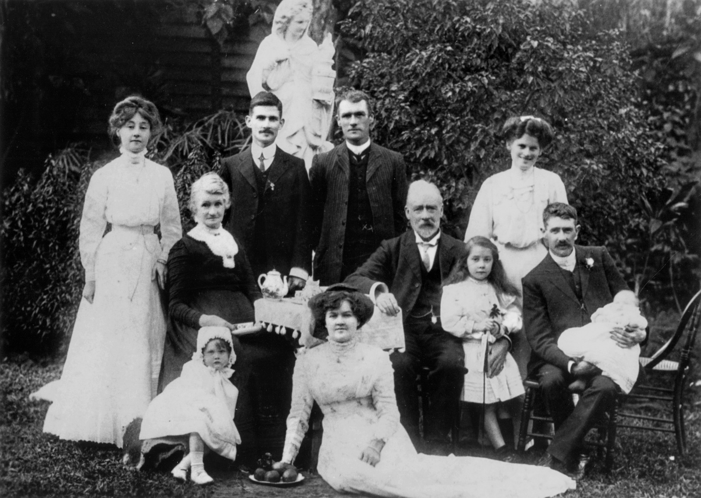

## Martha (Pattie) Soutter <small>[(18‑167‑18)](https://brisbane.discovereverafter.com/profile/31815860 "Go to Memorial Information" )</small>

Pattie Soutter was born in Hull, England and came to Queensland in 1882. She was a prolific writer of poems and letters to the editors of the *Brisbane Courier* and later the *Courier Mail* on a wide range of topics, contributing until 12 months before her death. Pattie was also instrumental in pushing for the establishment of a crematorium in Brisbane, indicating in a letter to the *Brisbane Courier* when she was 86 years of age that she wanted to be cremated when her time came. When she passed away on 28 September 1936, her wishes were carried out and her ashes placed in the grave of her husband who had predeceased her.

<figure markdown>
  { width=70% class="full-width" }
  <figcaption markdown>[Soutter family pictured in a garden setting, Brisbane, 1910](https://onesearch.slq.qld.gov.au/permalink/61SLQ_INST/dls06p/alma99183505973802061). Pattie Soutter (seated) on the left - State Library of Queensland.</figcaption>
</figure>
