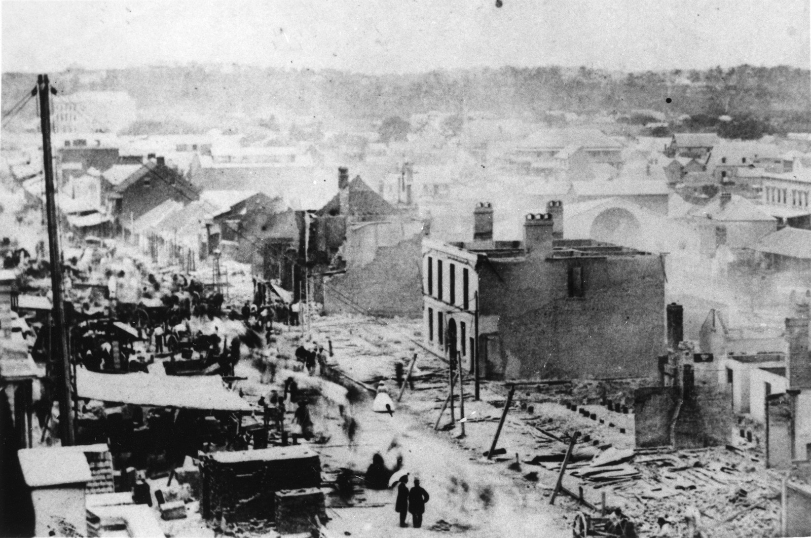

## Martin Moffatt <small>(7A‑74‑14)</small>

Martin Moffatt (ca.1843-1905) was the station keeper of the Valley Fire Station in Ann Street. He attended many of the major fires in Brisbane during his 31 years of service, including one at Alfred Shaw & Co in 1891 when [he was seriously injured](https://trove.nla.gov.au/newspaper/article/184253875). He was born in Antrim Ireland in 1842, the son of Luke Moffatt and Isabella McCormick. He married Mary McAlister in 1871 in Brisbane.

<figure markdown>
  { width="70%" class="full-width" }
  <figcaption markdown>[Great fire in Queen Street, Brisbane 1864](https://onesearch.slq.qld.gov.au/permalink/61SLQ_INST/tqqf2h/alma99183505953002061). — State Library of Queensland.</figcaption>
</figure>
