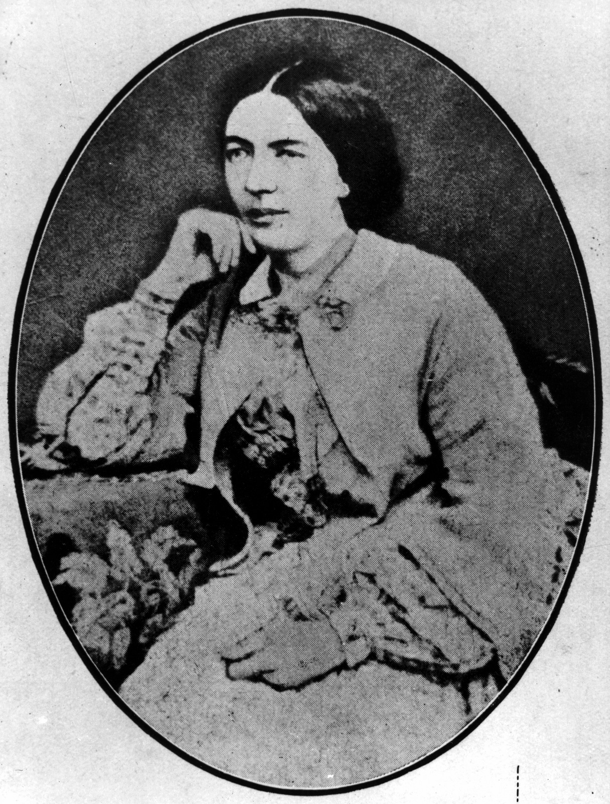

## Mary ‘Eva’ O’Doherty <small>(7‑58‑27)</small>

Mary Anne Kelly (better known as ‘*Eva of The Nation*') was born in Headford, County Galway, at the home of her maternal grandparents, on 15 February 1830, the daughter of a wealthy gentleman-farmer Edward Kelly of Killeen near Portumna who had nationalist sympathies. At the age of twelve, Mary Kelly sent her first verse to Charles Gavan Duffy, founder of The Nation newspaper when it started in Dublin in 1842. The poem expressed her feelings towards the British who governed the whole of Ireland at that time. Mary Kelly later adopted the pen name of ‘Eva’. 

She became romantically involved with a young medical student Kevin O’Doherty who was one of the rising men in the Irish national movement. As a result of the Young Irelander Rebellion of 1848, Kevin O’Doherty was found guilty of sedition and sentenced to transportation to Van Dieman’s Land. ‘Eva’ continued to write prose and poetry with many lyrics mourning the absence of her then fiancé as she waited for his release. 

Despite a conditional pardon which forbade residence in the United Kingdom, Kevin O’Doherty entered illegally into Ireland. A few days later, the couple married in a clandestine ceremony in London. After Dr O’Doherty completed further medical studies, the family with by then three sons migrated to Australia, and made their way to Ipswich and later to Brisbane.

The family struck hard times later in life and, after Dr O’Doherty’s death, the Irish community conducted fund-raising activities to assist ‘Eva’. [Her poems](https://www.oldqldpoetry.com/eva-mary-odoherty) were published in 1909 with the help of a priest. Eva died from influenza on 19 May 1910 at the age of 81.

<figure markdown>
  { width="40%" class="full-width" }
  <figcaption markdown>[Portrait of Mary Eva O'Doherty](https://onesearch.slq.qld.gov.au/permalink/61SLQ_INST/dls06p/alma99183505559502061) — State Library of Queensland.</figcaption>
</figure>
