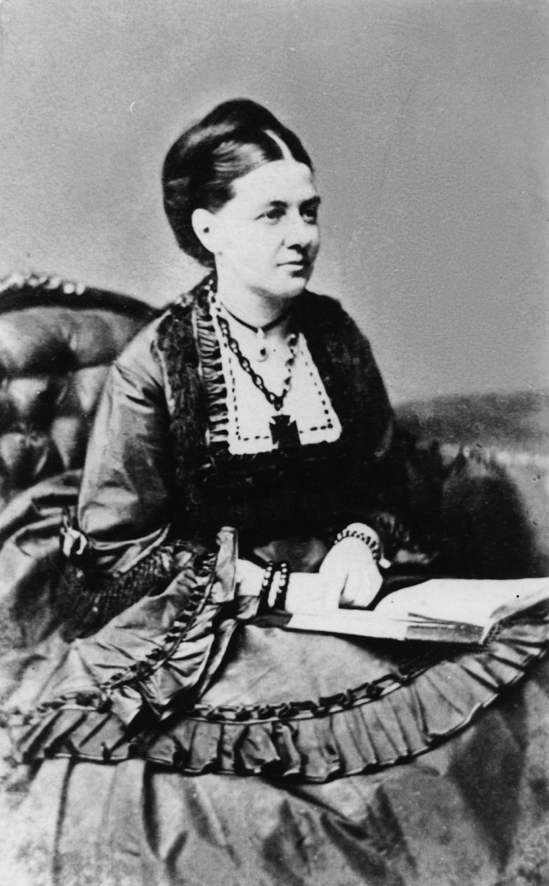

## Mary Douglas <small>(9‑34‑5)</small>

Born Mary Ann Simpson, ca. 1828, she was the third daughter of the Reverend William West Simpson M.A., a Church of England minister, who immigrated to New South Wales in 1840. In November 1848, aged twenty‑one she married Henry Callander, the eldest son of Randall W. Callander of Stirlingshire, Scotland. In 1852 Callander died aged 31 and Mary married William Howe and bore a daughter, Mary West Howe, in 1857. This second union ended with Howe’s death, and it was as twice‑widowed in Sydney, that she met and married the distinguished bachelor, John Douglas, in 1861. Douglas was the nephew of the Marquis of Queensbury, a former pupil of Rugby School, and graduate of Durham University. He represented Camden, NSW at the time.

Mary Douglas moved into the spotlight of Queensland public life when on June 22, 1865 the Hospital Committee noted that ‘a letter from Mrs Douglas relating to nursing of children. She was the leader of the ladies’ committee, a reflection of the confidence and respect in which she was held by the Hospital committee. An offer of Mary Douglas and the ladies’ committee was to be the beginning of institutional care for orphaned, destitute and neglected children in Queensland. By the end of 1865 the child‑rescue institution at the Fever Hospital had become a busy centre for the increasing number of children unable to be cared for in the southeast of the colony and it was fast becoming a place of placement of any destitute child. The Fever Hospital was not strictly speaking an orphanage: parents who could persuade the orphanage committee of their need stood a good chance of having their application accepted and their child admitted.

In 1869 a marked change occurred in management when John and Mary Douglas departed for London where John took up the position of Queensland Agent‑General. Around this time Governor Blackall made a public presentation of a silver salver to Mary Douglas and the Ladies’ Committee, in the presence of a veritable ‘Who’s Who’ of Brisbane society gathered at the Diamantina Orphanage. On her return Mary held a prominent and influential position in the child‑saving movement in Brisbane. However, in 1875 and 1876 during her endeavour to assert more direct managerial control over the orphan school – a model almost unheard of during this time.

In November 1876, Mary Douglas was travelling in her pony‑drawn gig from her home in Bonnie Avenue, Clayfield to Brisbane when she was involved in an accident close to Newstead House gates, Breakfast Creek. Her pony shied at an approaching dray and her vehicle ran up a steep bank and overturned throwing Mary out. She died twelve hours later from severe injuries.^1^

{ width="40%" }

*<small>[Portrait of Mrs John Douglas](http://onesearch.slq.qld.gov.au/permalink/f/1upgmng/slq_alma21218519880002061) - State Library of Queensland. </small>*
