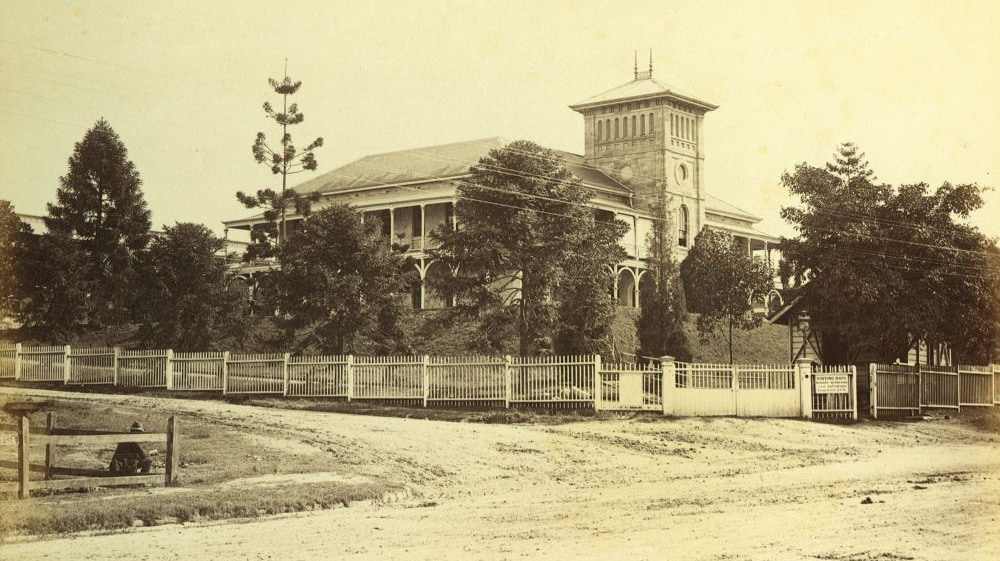

## Mary Elizabeth Weedon <small>(4‑3‑20)</small>

Mary Weedon, who trained at London’s Charing Cross Hospital, was the first head nurse of the Brisbane Hospital, holding the position for five years from 1885. She was the Vice‑President of the Australasian Trained Nurses’ Association (ATNA), Queensland Branch from 1904 to 1905 and a councillor from 1905 to 1906. 

Mary and her friend, Annie Griffiths, shared a house called *Garton* in Terrace Street, Toowong for many years. They were also members of the congregation of St Thomas Anglican Church. They died within eighteen months of each other; Mary in March 1942 and Annie in July 1943. Mary and Annie are buried in the same grave.

{ width="70%" }  

*<small>[Royal Brisbane Hospital, ca. 1885](http://onesearch.slq.qld.gov.au/permalink/f/1upgmng/slq_alma21271923160002061) — State Library of Queensland.</small>*
