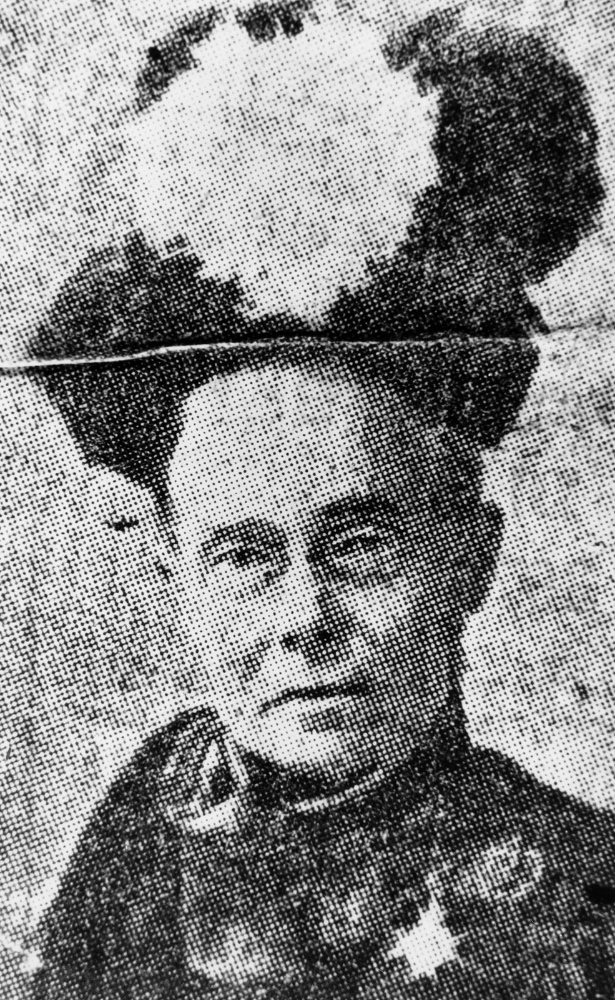

## Mary Harriett Griffith <small>(13‑77‑12)</small>

Mary Harriett Griffith was born on 4 November 1849 at Portishead, Somerset, England. She was the older sister of Sir Samuel Walker Griffith who was Colonial Secretary, Queensland Premier from 1883 to 1888, Chief Justice of the High Court of Australia and a principal author of the Constitution of Australia.

After the deaths of her parents Mary immersed herself in good works. She became founding secretary of the Brisbane Benevolent Society, honorary secretary of the Lady Musgrave Lodge, Queensland representative for the Travellers’ Aid Society, president of the YWCA in Brisbane, vice-president of the British (Australian) Red Cross Society during World War I and patroness in 1921 of St David’s Welsh Society as well as being involved in many other organisations. In 1911 Mary Griffith was created a Lady of Grace of the Order of the Hospital of St John of Jerusalem. Mary passed away on 27 July 1930 in her 81st year.

<figure markdown>
  { width="30%" class="full-width" }
  <figcaption markdown>[Mary Harriett Griffith, sister of Sir Samuel Walker Griffith](https://onesearch.slq.qld.gov.au/permalink/61SLQ_INST/dls06p/alma99183505134202061) — State Library of Queensland.</figcaption>
</figure>