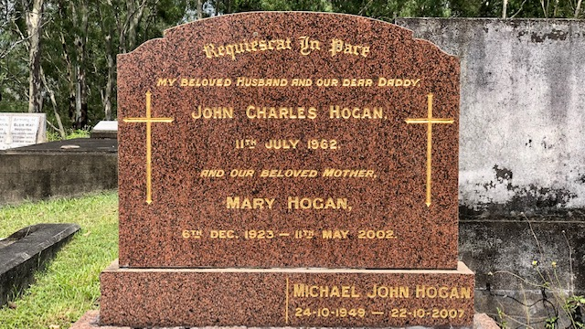

## Mary Hogan <small>(22‑16‑18)</small>

Mary Hogan (née Wells) was born in 1923 in Euroa, Victoria and completed her education at Star of the Sea Convent, Melbourne before training as a nurse at Wangaratta Base Hospital. Mary next completed her midwifery training before marrying John Hogan in Brisbane in 1949 and having four children. She worked in various Brisbane hospitals including St. Helen's and Mt. Olivet, and then trained as a Maternal and Child Welfare Sister. 

As the result of an accident, Mary was widowed in 1962. She then worked full time as a clinic sister in the Inala, Darra, and Wacol areas while raising her 4 children alone. Her final working position as a nursing sister was at Canossa Hospital, where Mary herself died from multiple myeloma in May 2002, aged 78. After 40 years as a widow, Mary Hogan was buried in Toowong Cemetery alongside her beloved husband John in the grave she purchased in 1962. She was a mother, grandmother, nurse and friend to many.

{ width="70%" }  
