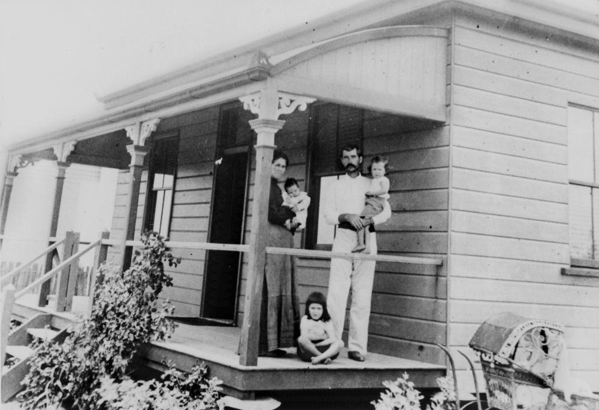
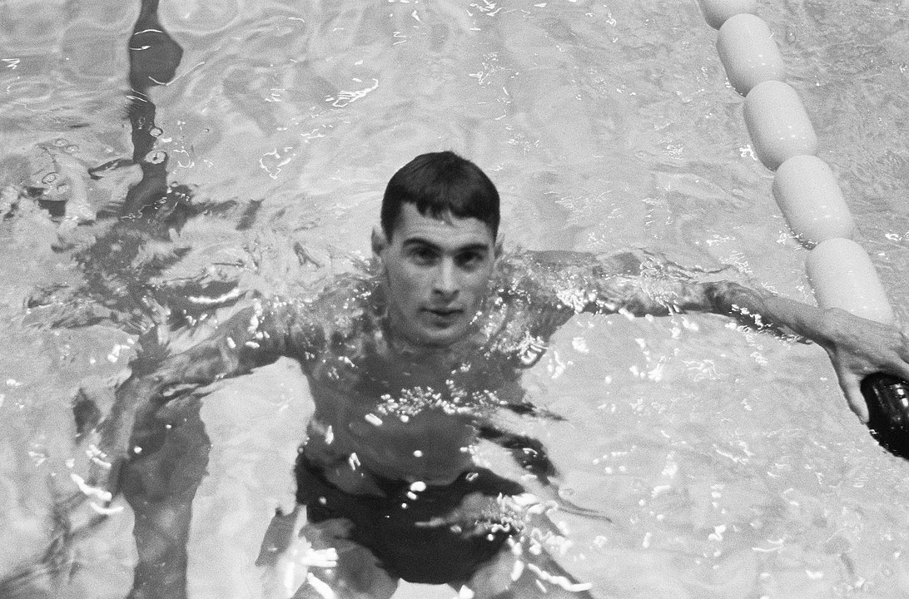

## Michael Joseph Devitt <small>(15‑29‑6)</small>  

Born 1859 at Ennistymon in County Clare the first born of a very large family. He, his parents Thomas and Bridget and most of his siblings migrated to Australia. Out of the 12 children one stayed in Ireland 2 died as babies, one went to Ohio in the USA and one to NSW and the remainder came to Queensland. 

The family left Ireland for London and boarded the *RMS Dacca* heading for Queensland. The trip took a little longer than expected. The ship left London 29^th^ April 1890 and the trip was interrupted at 6.30AM on the 16^th^ May when she hit the Daedulus Reef in the Red Sea. All passengers were able to climb down onto the rocks of the reef where they all stood in waist deep water until some were moved to the rocks surrounding the lighthouse. According to the *London Illustrated News*, May 20^th^, The passengers lost everything except the wet clothes they were standing in when the ship sank four hours later. No lives were lost. 

Michael and the rest of the family settled in Warwick and he practiced tailoring in partnership with his father in Fitzroy Street. He married Catherine Stokes in Warwick 1 June 1891. She was born in Moycarkey in Tipperary. He died in Brisbane on 26 December 1917 and was buried the next day. They had four children two of whom died very young. His son Francis Patrick Devitt (Sonny) joined the Australian Army and died 5 August 1915 six months before his 21^st^ birthday and is buried in France. Devitt St beside Warwick racecourse is named for the Devitt family.

{ width="70%" }  

*<small>[Devitt family home in Warwick, Queensland, 1906](http://onesearch.slq.qld.gov.au/permalink/f/1upgmng/slq_alma21218531370002061), Ann Ruth Devitt with son Matthew Francis and James Devitt with son Kevin. Young James John Devitt is seated on the edge of the verandah. — State Library of Queensland.</small>*

Michael Joseph Devitt 1892—1932 buried in the same grave was his son born 11 June 1892 and he was a horse trainer and show rider. He also joined up but a pleading emotional letter from his mother to the Army echelon begging them to discharge him and stating her need of his support saw him discharged after 8 weeks. He came down to the Brisbane National show to ride in the men’s event and met a young lady Zora Brenda Pitt who was the ladies champion rider that year. They married in 1917 in Brisbane and raised their family of a boy and a girl at various railway stations as he became the manager of railway refreshment rooms. Babinda, Roma St, Helidon and mainly Bundaberg When royalty visited Bundaberg the only place big enough to host the function was the refreshment rooms. He was well respected. He took ill in 1932 and was brought down to Brisbane and sadly died at the very young age of 39 on 24 March 1932 leaving Zorah to bring up two young children. She took up millinery and many were the fashionable ladies at the Brisbane races wearing her creations.

Their son Francis Pitt Devitt served in WWII and was one of the brave Aussies who found themselves up against Japanese Imperial Marines in Bougainville. All specially chosen for being 6 feet plus tall and not a pair of glasses among them. He survived but was always troubled by what he had to do and is buried in Mt Gravatt in the military section. Their daughter Brenda Pitt Devitt, a top horsewoman, artist and photographer married a jockey who became Qld’s premier jockey 9 times and over 1800 wins and they travelled the world but mainly UK and France where he rode a further 850 winners and was privileged to ride for the Queen.

John Devitt of Olympic fame and William Devitt who was John Wren’s right hand man in Queensland are both descended from Thomas and Bridget. 

{ width="40%" }  

*<small>[John Devitt at the 1960 Olympics](https://en.wikipedia.org/wiki/John_Devitt) — [CC0](https://creativecommons.org/publicdomain/zero/1.0/deed.en)</small>*
