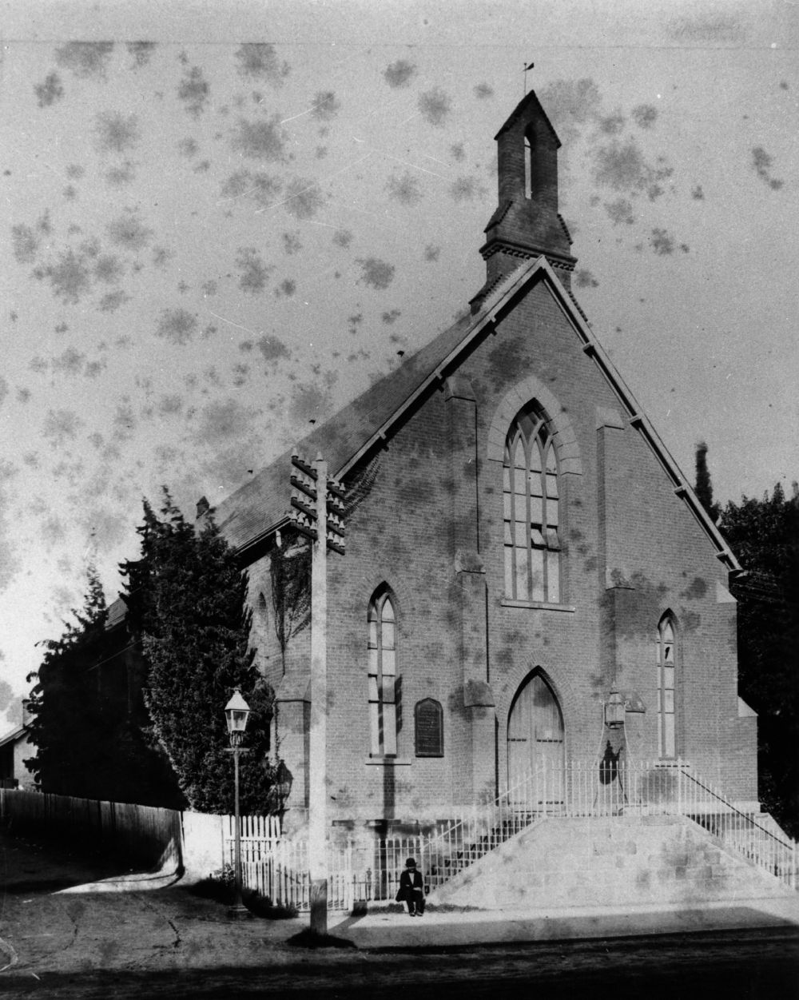

## Nathaniel Lade <small>(13‑52‑20/21)</small>

Nathaniel Lade, a saddler by trade, was born in Hythe, Kent on 30 March 1835 and died on 17 July 1895 after a number of years of poor health. Together with his Cornish‑born wife Elizabeth Helen Bridges, he fathered at least fifteen children, six of whom died in childhood. He was an office‑bearer and Sunday School official at the Albert Street Wesleyan Church in its early days. Later he became an inaugural trustee the Coorparoo Methodist Church which opened in June 1886 on the corner Cavendish Road and York Street. The Sunday School opened a month later with Nathaniel Lade as Superintendent. By 1889, there were 139 attendees and fourteen teachers. 

In the editorial written at the time of his death, Nathaniel was described as being *'amongst the oldest business men in Brisbane, and he was always held in the highest respect by his fellow citizens'*. Although very civic‑minded, he never took an active part in politics. Lade Street in Coorparoo is named after him.

{ width="40%" }  

*<small>[Wesleyan Church erected on the corner of Albert Street and Burnett Lane, in 1856](http://onesearch.slq.qld.gov.au/permalink/f/1upgmng/slq_alma21220540430002061) — State Library of Queensland.</small>* 
