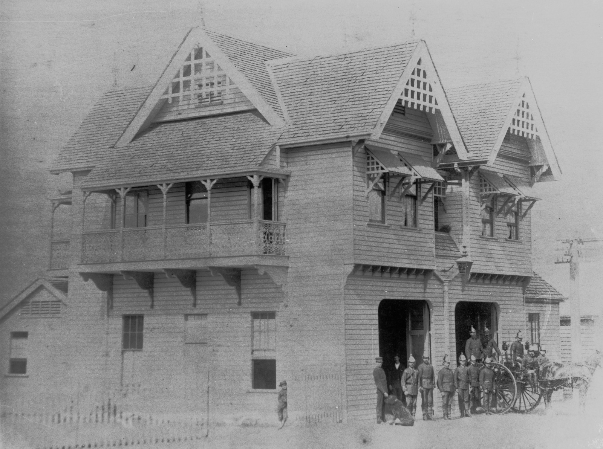

## Nicholas Frederick Peut <small>(13‑44‑13)</small>

Nicholas Peut (1856-1892) was appointed to the Brisbane Fire Brigade as resident foreman of No 2 station located at Stanley Street, South Brisbane in 1883. He became Superintendent at South Brisbane in January 1888 and continued in that role with the inception of permanent Fire Brigades with full time staff in Brisbane in 1889. [He was fatally injured](https://trove.nla.gov.au/newspaper/article/3552275) on 5 December 1892.

<figure markdown>
  { width="70%" class="full-width" }
  <figcaption markdown>[South Brisbane Fire Station, ca. 1900](https://onesearch.slq.qld.gov.au/permalink/61SLQ_INST/dls06p/alma99183507972502061). — State Library of Queensland.</figcaption>
</figure>
