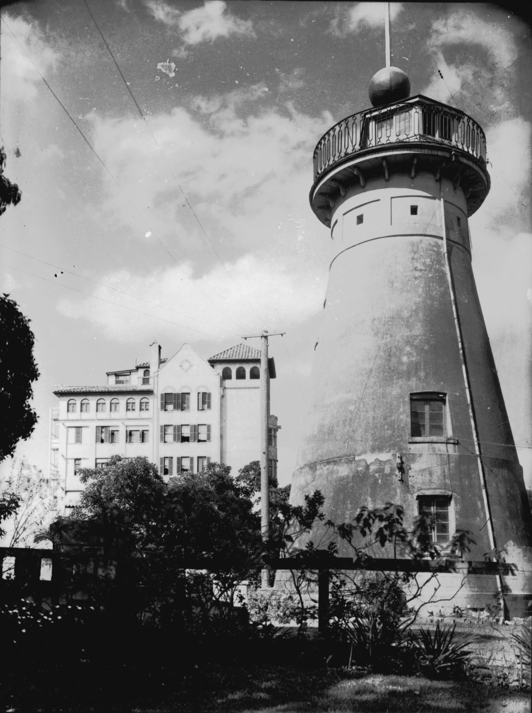

Nora and Catherine were the daughters of Cornelius and Catherine Fitzgerald. They had emigrated from Ireland in the late 19^th^ century. Nora received her Brisbane Hospital Certificate in 1894 and remained on the staff. Nora was a charge nurse from 1897 to 20 February 1899 when she left to marry Dr Arthur Halford (see above). Nora died on 9 August 1932 aged 63. She is buried with her sister Catherine Fitzgerald who was also trained nurse. 

Catherine received her Brisbane Hospital Certificate in 1896 and remained on staff as a ward nurse until 1898. Catherine was one of the first councillors of ATNA, Queensland Branch that was formed in 1904. She remained a councillor until 1918 when she became Vice‑President (1918‑1921). Catherine was Matron of the Alexandra Private Hospital, located in Wickham Terrace, from 1904, later becoming the owner. She was also a member of the ANTA Nurses’ Rest Home Committee. In her retirement Catherine lived at Craigston, Wickham Terrace, until her death. She died on 23 January 1931 aged 63.

{ width="40%" }  

*<small>[Windmill and Craigston apartments, in Wickham Terrace ca. 1934](http://onesearch.slq.qld.gov.au/permalink/f/1upgmng/slq_alma21218889220002061) — State Library of Queensland.</small>*
