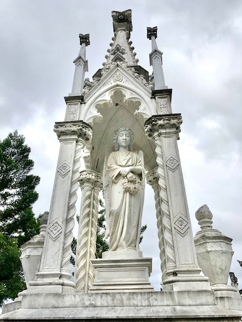
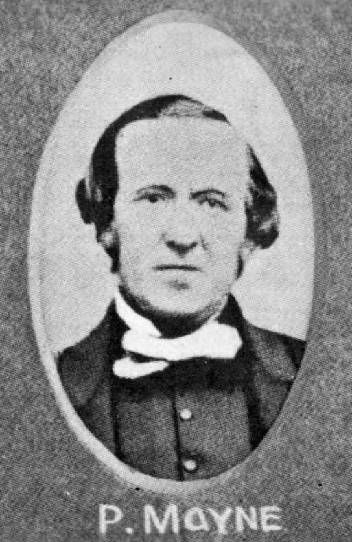
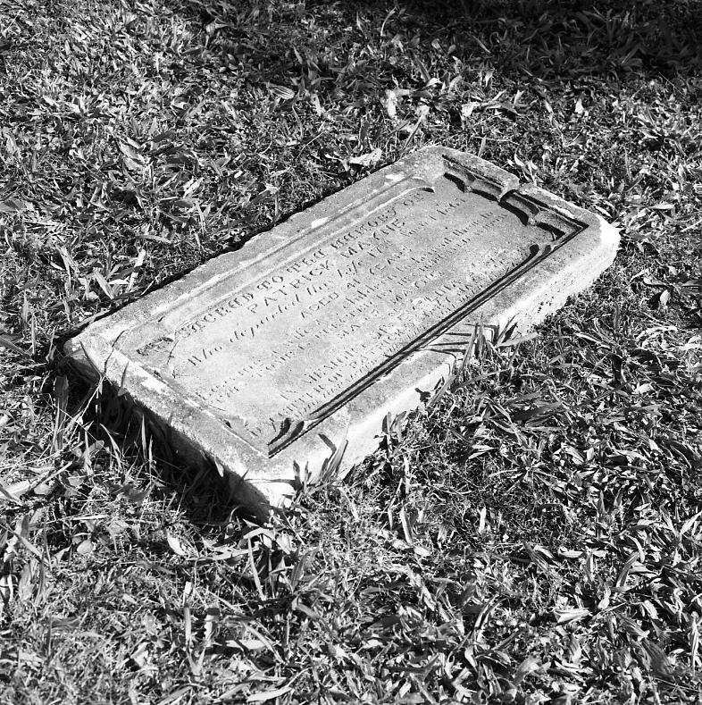

## Patrick Mayne <small>(7‑49‑9)</small> 

The large white monument to this family and the story of how Mayne gained his wealth is the subject of a book by Rosamond Siemon, *The Mayne Inheritance*. Mayne was born in 1824 at Cookstown, Tyrone, the son of Isaac Mayne and Rose Mullin. He arrived in Brisbane in 1849 after marrying in Sydney, Mary McIntosh from Ennis, Co. Clare. 

Mayne gained his wealth by the reputed murder of a cedar cutter and established his butcher business in Queen St where the present Brisbane Arcade stands. He was an Alderman of the Brisbane City Council 1853 to 1865, the year he died of a heart attack. His rumoured death‑bed confession extracted a promise from his children that they would not continue the family line. The family’s finances eventually benefited many public institutions especially The University of Queensland.

{ width="40%" } 
 
*<small>Mayne Monument, Toowong Cemetery</small>*

{ width="26.1%" }  { width="40%" }  

*<small>[Alderman Patrick Mayne](https://library-brisbane.ent.sirsidynix.net.au/client/en_AU/search/asset/19843/0), 1859 — Brisbane City Council.</small>*  
*<small>[Headstone of Patrick Mayne, Hale Street Cemetery Reserve, Milton](https://library-brisbane.ent.sirsidynix.net.au/client/en_AU/search/asset/20639/0) — Brisbane City Council.</small>*

>Sacred to the memory of  
>Patrick Mayne  
>Who departed this life 17^th^ August 1865  
>Aged 41 years  
>leaving a wife and 5 children to lament their loss   
>This stone is erected by his ??? widow   
>Mary Mayne   
>also   
>In memory of Evelina Selina  
>daughter of Patrick & Mary Mayne    
>Aged 7? Months ? Days   

Patrick and daughter Evelina were re-interred in Toowong Cemetery in 1889
