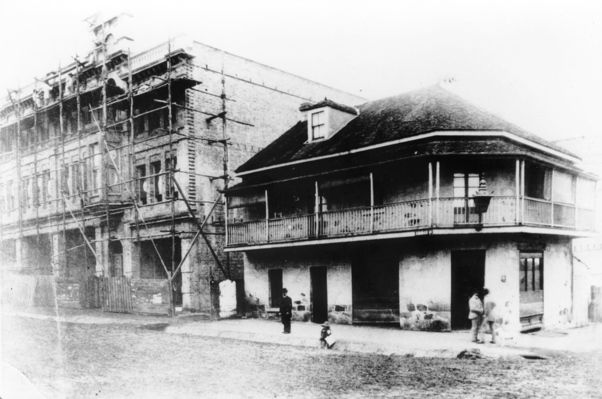

## Peter Gaffney <small>(7‑19‑23)</small> 

Born in 1839 in Co. Cavan, Gaffney was the publican of the Dunmore Arms on the corner of George and Elizabeth Streets. He married Margaret Malynn in Brisbane in 1872 and together they had three children. Peter died of heart failure while bathing at Sandgate in 1879. His wife remained as publican until the licence expired in 1887.

{ width="70%" }  

*<small>[Jaffrey, P. (1886) Dunmore Arms Hotel, George Street (now Treasury Hotel)](https://digitalcollections.qut.edu.au/3850/) — Jaffrey, P. (1886), Public Domain</small>*

<!-- TODO Gaffery or Jaffery? -->
