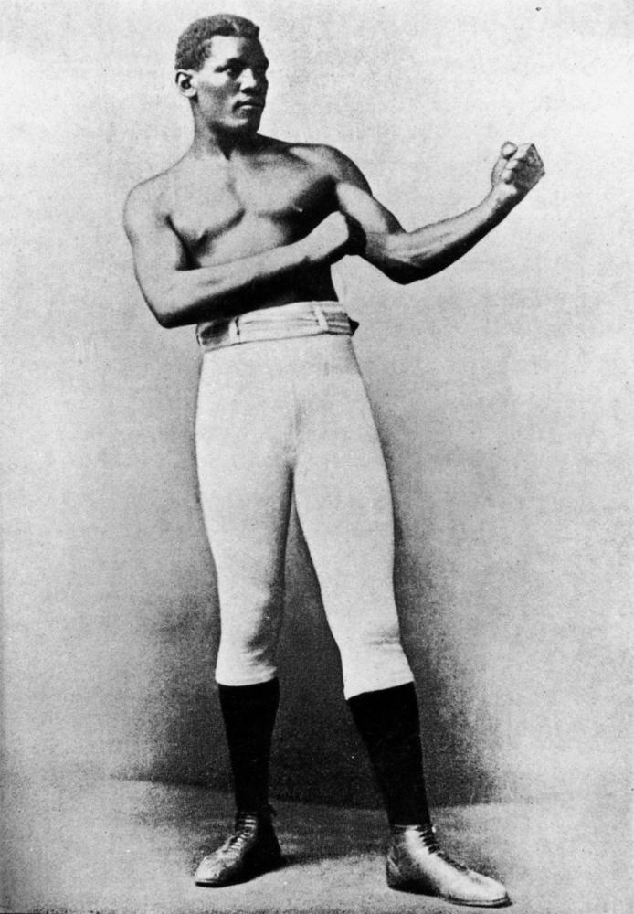
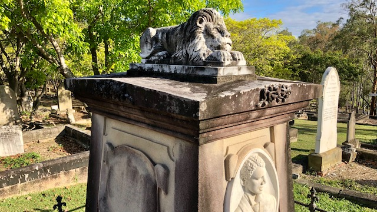

## Peter Jackson <small>(5‑28‑1)</small>

Peter Jackson was born on 3 July 1861 and was Australian Heavyweight Champion 1886-1888. One of the legendary Boxers and probably the most famous sportsperson buried in Brisbane. World Heavyweight Champion John L. Sulliva refused to fight Jackson because of his colour. Jackson fought a 61 round draw with James J Corbett in San Francisco on 21 May 1891. James (Gentleman Jim) Corbett later went on to beat John Sullivan for the Heavyweight Championship.

Year later Corbett wrote that Peter Jackson was one of the greatest fighters he had even seen. Jackson defeated Australia's Frank Slavin in London on 30 May 1892 in what is still regarded as one of the greatest fights ever seen in England. Sadly Peter Jackson died in Roma on 13 July 1901 of Tuberculosis. Roma locals wanted to bury him there but it was proposed that it would be more befitting for him to be buried in Toowong Cemetery.

John and Julia Dowridge were mainly responsible for Peter Jackson being bought down from Roma to Toowong Cemetery for burial. They all now rest peacefully together. John and Julia Dowridge are buried in front of Peter Jackson. 

Career 1882-1899. 103 Bouts. 42 Wins, 8 Draws, 50 No Decisions.

Peter's headstone is one of a handful that have the deceased's face chiselled on it. It is unusual in that it is the biggest of this kind in the Cemetery. The headstone is an Altar Tomb style, with a Lion overseeing the grave (the only Lion in the cemetery).

{ width="26%" }  { width="66.3%" }

*<small>[Boxer Peter Jackson who came to live in Queensland from the West Indies, ca. 1880s](http://onesearch.slq.qld.gov.au/permalink/f/1upgmng/slq_digitool116252) - State Library of Queensland </small>*
