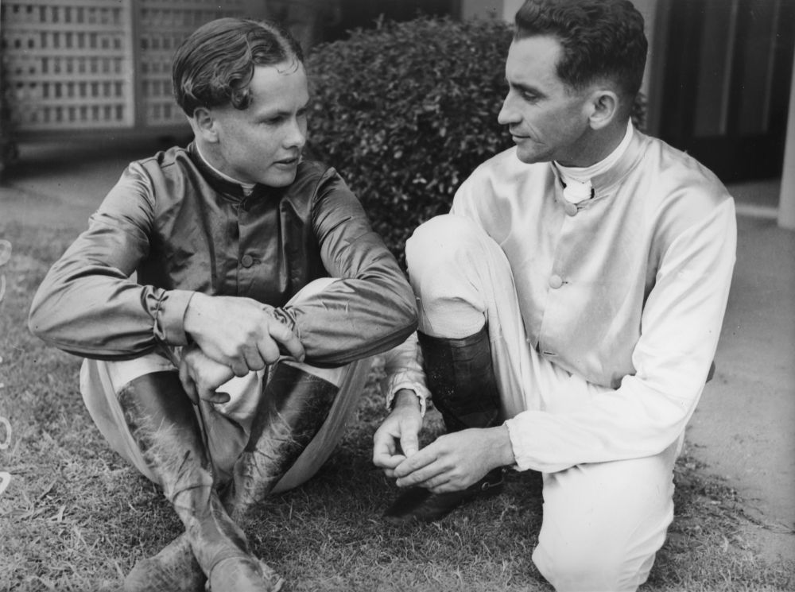

## Peter Morgan <small>(1‑88‑4)</small>

Peter was an extremely capable rider. According to those who knew him he was as good as George Moore, Neville Sellwood, Russ Maddock and Digger McGrowdie. All Queenslanders like him. He was well regarded by all in the racing game. He had one failing though and that was his lack of confidence in himself. There were many occasions when he rode a horse trackwork and prepared it for a major race but declined to ride the horse in a major event for fear of making a mistake. He never faltered in minor events but would rather sit on the fence when it came to the big races. That is not to say he did not ride in some big races and with success. 

<!-- He had an unusual death for a jockey and that will be explained now.  -->

{ width="70%" }

*<small>[Two jockeys having a friendly chat, 1941](http://onesearch.slq.qld.gov.au/permalink/f/1upgmng/slq_alma21220068470002061). Left to right, jockeys Peter Morgan and Tom Spencer pose for the camera - State Library of Queensland. Tragically [Peter Morgan drowned in Schultz Canal](https://trove.nla.gov.au/newspaper/article/42787041) at Hendra/Toombul. </small>*
