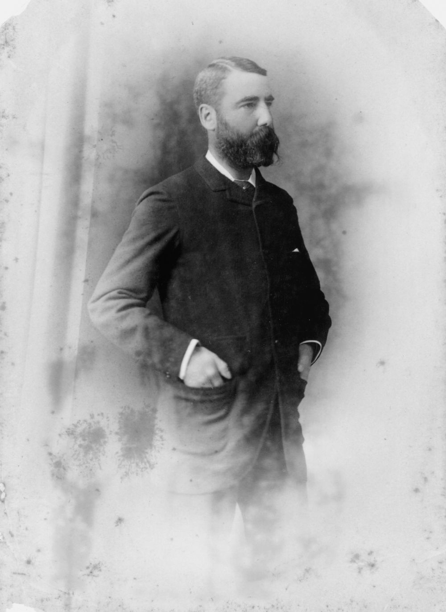

## Sir Pope Alexander Cooper <small>(13‑37‑1)</small>

Deputy Governor for short periods in 1917 to 1919

Cooper was born on 12 May 1846 at Lake George, New South Wales, son of Francis Cooper, a wealthy squatter, and his wife Sarah, née Jenkins. After graduating from the University of Sydney in 1868, he went to London to study law and was called to the Bar on 6 June 1872. Cooper returned in 1874 and was admitted to the Queensland Bar. He became Crown Prosecutor in the northern district Supreme Court in 1878. After the death of Henry Beor, McIlwraith appointed Cooper his Attorney‑general. The appointment was ratified on 24 January 1881 when he won Beor's Bowen seat. Cooper held his office and seat until 5 January 1883 when he was appointed to the northern bench of the Supreme Court. He was elevated in October 1895 to senior puisne judge in Brisbane. 

When Griffith became Chief Justice of the High Court of Australia, the Morgan ministry appointed Cooper Chief Justice of Queensland on 21 October 1903. Cooper was knighted in 1904. Although Cooper had temporarily deputised for the Governor in 1906, when the need to appoint a Lieutenant‑governor to succeed Sir Hugh Nelson arose in 1907, Lord Chelmsford could not ignore the objections of Premier William Kidston and he was passed over. Since Cooper had publicly censured the Ryan ministry in November 1915 and had publicly objected to its socialism, he was still regarded as unsatisfactory for the Lieutenant‑governorship; but with no alternative, Governor Sir Hamilton Goold‑Adams had to appoint him as Deputy for short periods in 1917‑19. 

In November 1919, the Theodore ministry decided to appoint William Lennon as Lieutenant‑governor to which Cooper objected bitterly. Early in January he appealed for support from the governor‑general, and refused to admit the validity of a commission for Lennon drafted locally on telegraphic instructions from London; he deputised himself from 27 January to 3 February 1920 until Lennon's commission as Lieutenant‑governor arrived. That year while Lennon was on diplomatic sick leave in New South Wales, Cooper again became Lieutenant‑governor under his dormant commission. When asked, he refused to sign the executive council minute appointing Lennon president of the Legislative Council; he argued that the council was already over strength. On his return, Lennon was forced to appoint himself to the Council and to its presidency. Cooper died at his Chelmer home on 30 August 1923.

{ width="40%" }

*<small>[Hon. Sir Pope Alexander Cooper, Chief Justice of Queensland, 1880](http://onesearch.slq.qld.gov.au/permalink/f/1upgmng/slq_alma21218934570002061) - State Library of Queensland </small>*
