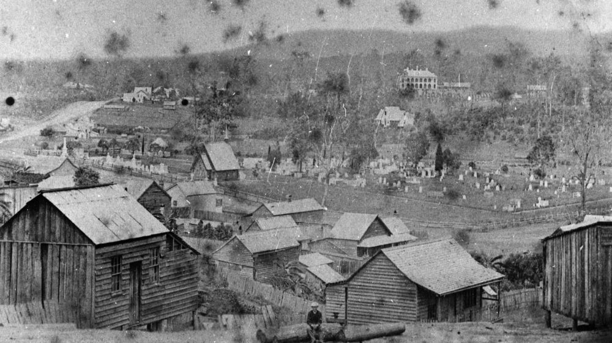

## Richard Belford <small>(15‑11‑6)</small>

For many years Richard was connected with the colonial press in NSW, Victoria and Queensland. He was a native of Newtown, Limavady, in the county of Londonderry, Northern Ireland and came to NSW in 1838 with his parents, Richard (Snr) and Ann (née Linton). 

He was a partner in starting the *Ballarat Star* but after the partnership collapsed, moved to Brisbane and then to Ipswich where he took charge of the *North Australian* newspaper. Richard followed when that newspaper moved to Brisbane and died at the age of 42 from consumption on 28 April 1865. He was originally interred in the Roman Catholic burial ground at Milton but his remains and headstone were relocated to Toowong Cemetery in 1913.

*<small>[View of the Brisbane suburb of Milton, ca. 1870](http://onesearch.slq.qld.gov.au/permalink/f/1upgmng/slq_alma21219311070002061) Photograph taken in the vicinity of Caxton Street, Petrie Terrace, looking due west across the intersection of Judge and Hale Streets and across the Milton Cemetery — State Library of Queensland. Cropped.</small>*
