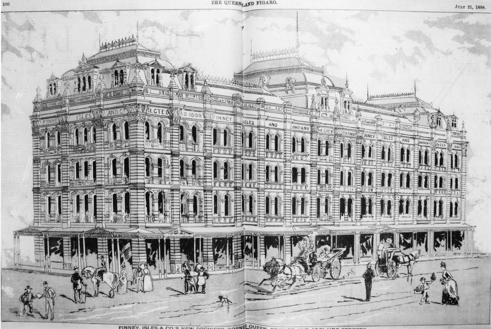

## Richard George Petty <small>(14‑22‑13)</small>

Richard Petty, born in 1836, was a native of Yorkshire and came to Queensland in the ship *Whirlwind* in 1862. His parents were Richard Petty and Margaret (née Crier). He went into business with William Grimes in 1863 operating a Clothing and Drapery Store at the top end of Queen Street. By 1877 they had moved to larger premises further down Queen Street, between Albert & Edward Streets. Richard died on 24 September 1899 at his residence *Coodra* on Gregory Terrace.

<!--
<figure markdown>
  { width="70%"  class="full-width" }
  <figcaption markdown>[Proposed sketch for the premises of Finney Isles & Co. on the corner of Adelaide Edward and Queen Streets, Brisbane, 1888](https://onesearch.slq.qld.gov.au/permalink/61SLQ_INST/dls06p/alma99184003619702061) — State Library of Queensland.</figcaption>
</figure>
-->