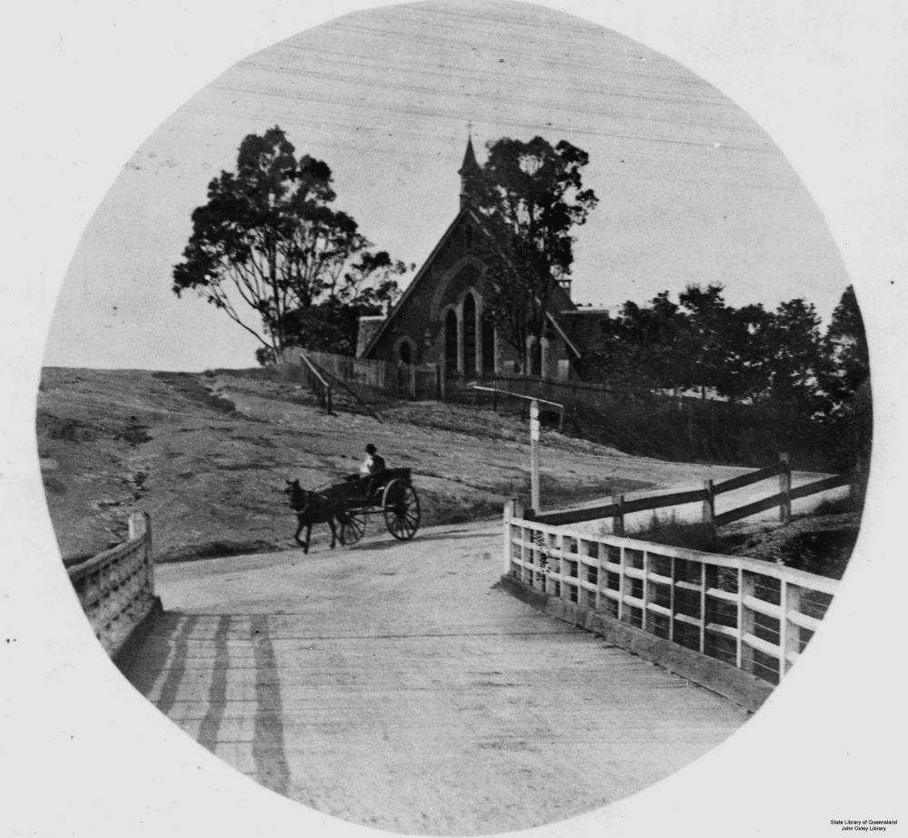

## Richard Langler Drew <small>(5‑43-22)</small>

Described by contemporary J. B. Fewings as *“the father of Toowong”*, Richard bought large blocks of land bordering Toowong Creek in 1861. He ascertained from the local Aborigines that Toowong was a suitable name for the area and posted the first sign as such. He and his wife Anne were founding members of the Anglican Church. In 1866, he donated part of his land in Curlew Street to build the first St Thomas Anglican Church.

{ width="50%" }

*<small>[View of Burns Road, Toowong, Brisbane at the intersection of High Street](http://onesearch.slq.qld.gov.au/permalink/f/1upgmng/slq_alma21220116110002061) ca 1910. The second St. Thomas' Anglican Church is in the background. It replaced an 1865 timber building on another site. - State Library of Queensland </small>*
