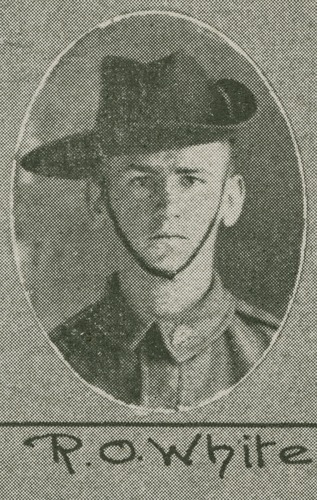
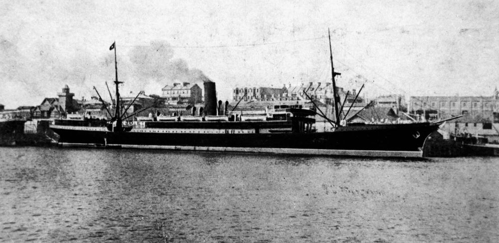

## Richard Oldfield White <small>(10‑57‑1)</small>

Richard joined the Brisbane Newspaper Company as a cadet journalist in July 1915. On turning seventeen, he enlisted in WWI on 2 August 1916. During training after arriving in England on *HMAT Marathon*, he was hospitalised with mumps. After recovering, he was assigned to the 7/52^nd^ Battalion and transferred to France where he saw service until March 1918 when he was sent back to England for treatment for trench foot. While there he was diagnosed with nephritis and invalided home to Australia. After his discharge from the Australian Imperial Force, he resumed his duties on the reporting staff of the *Brisbane Courier* until ill health forced him to enter Rosemount Repatriation Hospital where he died at the age of 27 on 22 October 1926.

{ width="22%" }  { width="71.15%" }

<small>[R.O. White, one of the soldiers photographed in The Queenslander Pictorial, supplement to The Queenslander, 1916](http://onesearch.slq.qld.gov.au/permalink/f/1upgmng/slq_digitool1001932) - State Library of Queensland</small>  
<small>[Marathon (ship)](http://onesearch.slq.qld.gov.au/permalink/f/1upgmng/slq_alma21218385960002061). Built in 1904 and weighing 7, 827 tons, the 'Marathon' belonged to the Aberdeen Line - State Library of Queensland</small>
