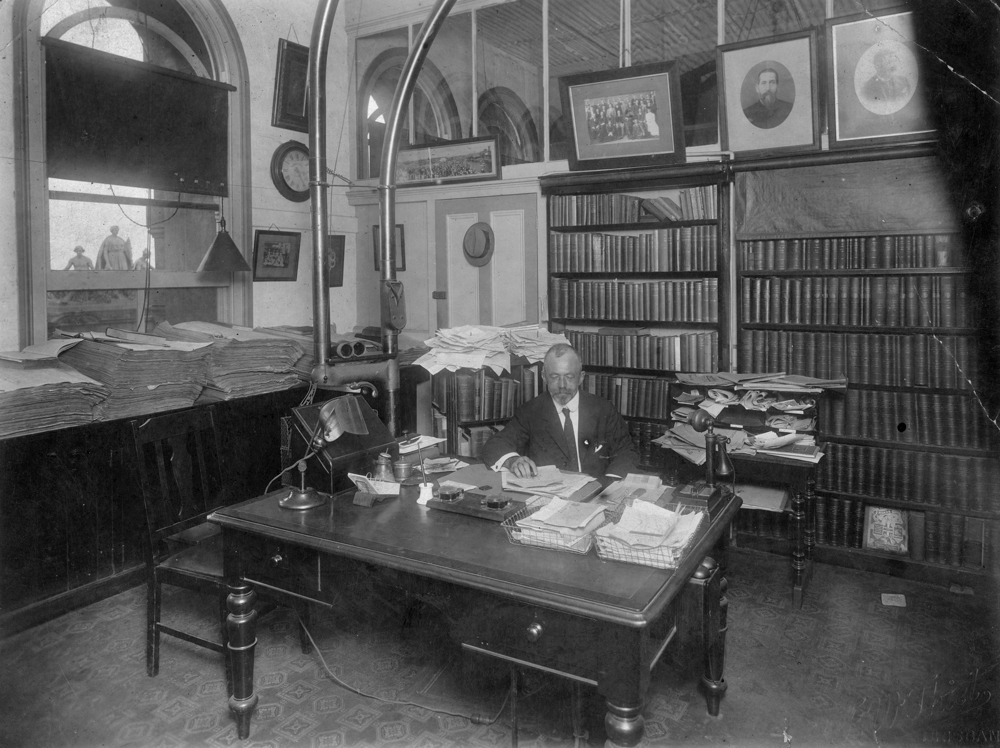

## Richard Sanderson Taylor <small>[(8‑49‑19)](https://brisbane.discovereverafter.com/profile/31735609 "Go to Memorial Information" )</small>

Richard Sanderson Taylor was born in Leeds, England in 1866 and came to Australia as a boy with his parents. He was educated in Sydney where his father was a Baptist Church minister. He began his journalistic career in the early 1880's on the Sydney *Daily Telegraph*. In 1888 he joined the *Brisbane Courier* and, with the exception of a short period spent on the Hansard staff, was a member of the *Courier* staff for the remainder of his life. Richard became principal law reporter and music and drama critic, a post that he held until he became principal leader writer. In June 1919 he became editor of the *Courier* until he suffered a paralytic stroke in April 1932 and passed away on 6 June of that year.

<figure markdown>
  { width=70% class="full-width" }
  <figcaption markdown>[Editor's office at the Brisbane Courier, ca. 1922](https://onesearch.slq.qld.gov.au/permalink/61SLQ_INST/dls06p/alma99183512990902061). Richard Sanderson Taylor, who was the editor at this time, is seated at his desk. - State Library of Queensland.</figcaption>
</figure>