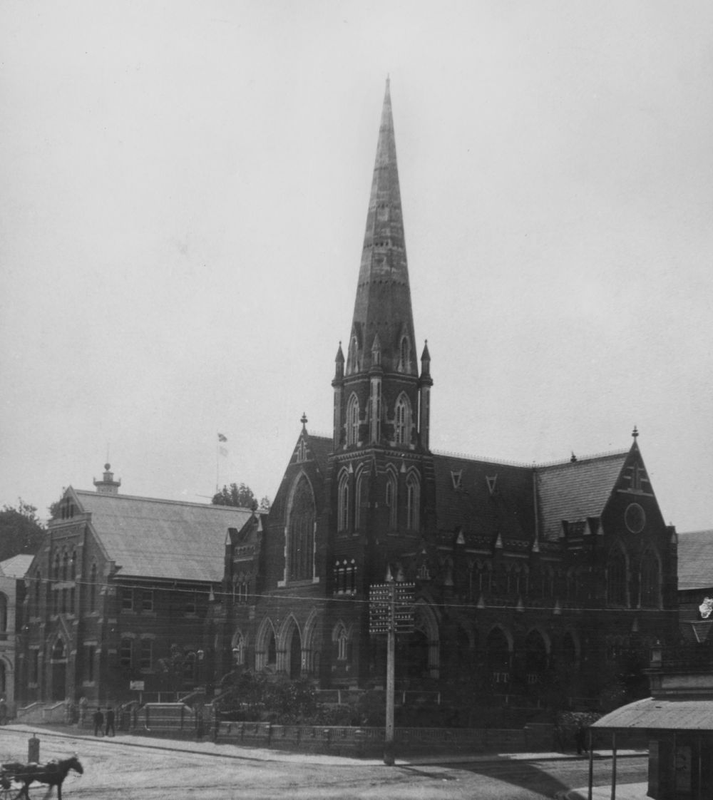
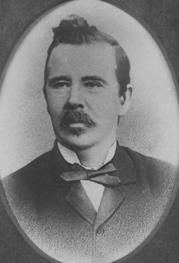

## Richard Southall <small>(13‑59‑12)</small>

Contractor Richard Southall was Brisbane’s twenty‑second Mayor in 1888. He was nominated for the East Ward in 1885. Amongst his projects was the construction of the Albert Hall in Adelaide Street. He married Janet Banks Guild, at St Marylebone, London on 26 July 1852. He is buried with his wife, son, daughter and mother‑in‑law.

{ width="40%" }  { width="30.55%" } 

*<small>[Albert Street Methodist Church and Albert Hall, Brisbane, ca. 1904](http://onesearch.slq.qld.gov.au/permalink/f/1upgmng/slq_alma21219167550002061) — State Library of Queensland.</small>*  
*<small>[Richard Southall](https://library-brisbane.ent.sirsidynix.net.au/client/en_AU/BrisbaneImages/search/detailnonmodal/ent:$002f$002fSD_ASSET$002f0$002fSD_ASSET:19766/one?qu=Richard+Southall&rm=BRISBANEIMAGES0%7C%7C%7C1%7C%7C%7C0%7C%7C%7Ctrue&te=ASSET&lm=ALL_ASSETS) — Brisbane City Council.</small>*
