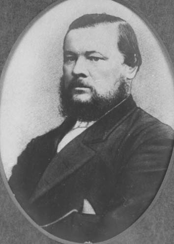

## Richard Symes Warry <small>(13‑49‑22)</small>

Richard Symes Warry was born about 1829 in England, son of Thomas Warry and Maria Symes. On 25 January 1851 in Brisbane, Richard Symes Warry married Mary Lydia Pratten. They had fourteen children, a number of whom died young. He died 12 March 1891 at his residence in Enoggera, aged 62 years. 

Richard Warry was a grocer and was one of the earliest of the Queen Street storekeepers, having had a shop for many years on the eastern side near the corner with Albert Street. Richard Warry was an Alderman of the Brisbane Municipal Council in 1862—1863 and 1865—1866. He was Mayor in 1866. He took a break from public life for a number of years and then [returned as Alderman of the West Ward](https://trove.nla.gov.au/newspaper/article/174694364) from 1883—1888 before finally retiring.

{ width="40%" } 

*<small>[Richard Symes Warry](https://library-brisbane.ent.sirsidynix.net.au/client/en_AU/BrisbaneImages/search/results?qu=Richard+Warry&rm=BRISBANEIMAGES0%7C%7C%7C1%7C%7C%7C0%7C%7C%7Ctrue&te=ASSET&lm=ALL_ASSETS) — Brisbane City Council.</small>*
