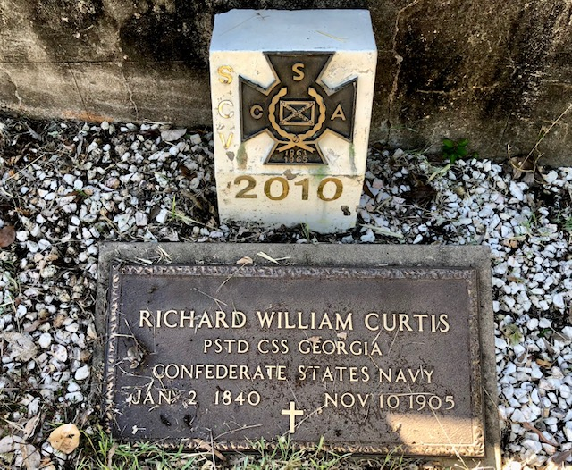

## Richard William Curtis <small>(5‑61‑22)</small>

Englishman Richard William Curtis (1840-1905) is one of six proven veterans of the American Civil War buried in Toowong Cemetery. He joined the Confederate States Navy and is recorded as being Assistant Paymaster on the CSS *Georgia* in 1863 and later Paymaster on CSS *Stonewall*. After the conclusion of the Civil War he came to Brisbane where he worked for the Government and in private enterprise.

 
