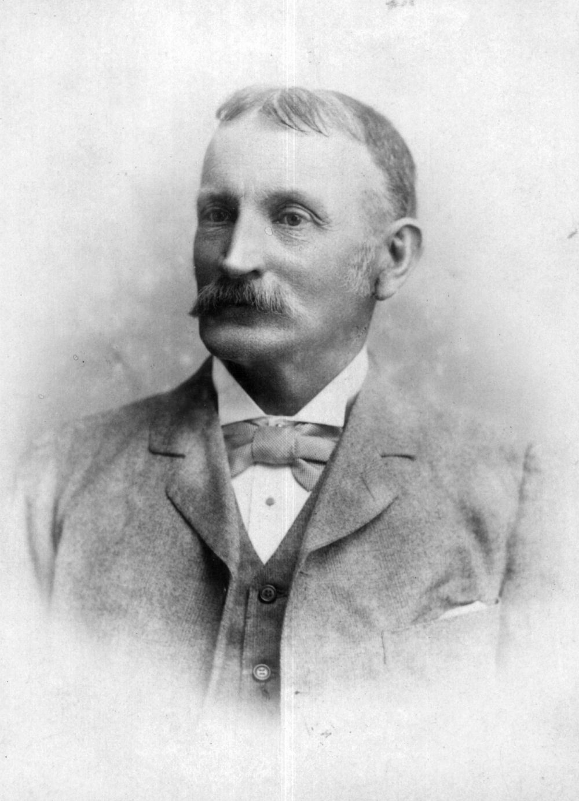

## Robert Archibald Ranking <small>(12‑35‑14)</small>

Robert Archibald Ranking (1843-1912) was born at Hastings, Sussex, England, fifth son of Robert Ranking, a surgeon, and his wife Isabella Eliza Hannah, née Spiers. In July 1864 he arrived in Brisbane and found work at Cressbrook Station, near Ipswich. He joined the Queensland civil service in 1874, and on being appointed police magistrate in 1879, he served at Beenleigh, Blackall, and Maryborough before being transferred to Rockhampton in 1889.  He was still stationed there in 1891 when he was given the daunting task of attempting to negotiate a reconciliation between the shearers and pastoralists. 

{ width="40%" }

*<small>[Robert Archibald Ranking](http://onesearch.slq.qld.gov.au/permalink/f/1upgmng/slq_alma21220238090002061) -  State Library of Queensland</small>*
