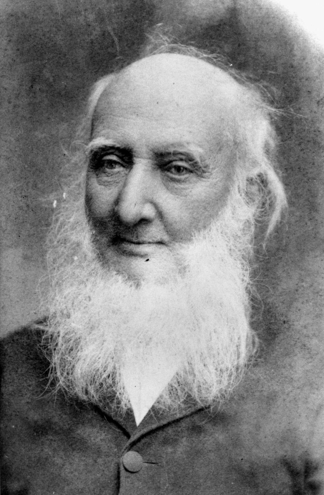

## Robert Cribb <small>(9‑37‑6)</small>

Robert came to the Colony of Queensland aboard the *Fortitude* in January 1849. He bought land in 1852 and built Lang Farm which stretched from the hilly part of Indooroopilly Road towards Jack Cook Park and down to the River. He cleared the pine trees and vines growing along Toowong Creek, growing oranges, cabbages, grapes, mulberries and olives. Land Farm was bought by Richard Gailey, who built his mansion *Glen Olive* on the riverbank. Robert was appointed to the first Toowong Shire Council in 1880. He died on 16 April 1893 aged 88.

{ width="25.4%" }  { width="68%" }

*<small>[Robert Cribb](http://onesearch.slq.qld.gov.au/permalink/f/1upgmng/slq_alma21218813510002061) State Library of Queensland </small>*  
*<small>[Houses submerged in the 1893 flood waters at Toowong, Brisbane, Queensland](http://onesearch.slq.qld.gov.au/permalink/f/1upgmng/slq_alma21220473300002061) - State Library of Queensland. Richard Gailey’s Glen Olive can be seen in the distance. </small>*

{ width="40%" }  

*<small>[Glen Olive Garden Estate on the river bank Toowong](http://onesearch.slq.qld.gov.au/permalink/f/1upgmng/slq_alma21119287420002061) - State Library of Queensland. This shows the site of the Glen Olive house and grounds.</small>*

<!--
<iframe width="560" height="315" src="https://www.youtube.com/embed/yqEivuBSHTw" title="YouTube video player" frameborder="0" allow="accelerometer; autoplay; clipboard-write; encrypted-media; gyroscope; picture-in-picture" allowfullscreen></iframe>

*<small>
[Black February: Queensland's most deadly floods (One Minute Archive)](https://youtu.be/yqEivuBSHTw) - Queensland State Archives
Queensland State Archives</small>*
--> 

<!-- TODO align height when using in story -->
