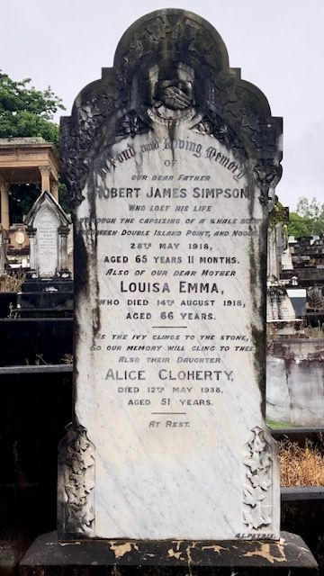

## Robert James Simpson <small>(20‑19‑30)</small>

The *Daily Standard* reported a *["Seaman's fatal immersion"](https://trove.nla.gov.au/newspaper/article/179405429?searchTerm=%22Robert%20Simpson%22)* on Wednesday 29 May 1918. 

{ width="30%" }  

>
In Fond and Loving Memory 
of  
Our Dear Father  
Robert James Simpson  
Who lost his life 
through the capsizing of a Whale Boat  
Inbetween Double Island Point, and Noosa  
28^th^ May 1918,  
Aged 65 years 11 months  
>
>
Also of our Dear Mother  
Louisa Emma,  
Who died 14^th^ August 1918,  
Aged 66 years  
>
>
As the Ivy clings to the stone,  
So our memory will cling to thee  
>
Also their Daughter  
Alice Cloherty  
Died 12^th^ May 1938,   
Aged 51 years  
>
>
At rest.
>

See also:

- [Cairns Pilot](https://trove.nla.gov.au/newspaper/article/40291149)
- [He was a Freemason S.C.](https://trove.nla.gov.au/newspaper/article/215428272?searchTerm=%22Robert%20Simpson%22)
- [Accident report](https://trove.nla.gov.au/newspaper/article/188926175) - 1882 a member of the pilot boat in Cairns
- [161 Hale St, K.M. Smith Undertaker](https://trove.nla.gov.au/newspaper/article/175196687)
- [Insolvent?](https://trove.nla.gov.au/newspaper/article/3439159?searchTerm=%22Robert%20Simpson%22) 
- [Intestate](https://trove.nla.gov.au/newspaper/article/20255673?searchTerm=Louisa%20Emma%20Simpson) 

### Louisa Emma Simpson (20‑19‑30)

- https://trove.nla.gov.au/newspaper/article/20259049?searchTerm=Louisa%20Emma%20Simpson - Louisa's funeral. Children names. 
- https://trove.nla.gov.au/newspaper/article/174299617?searchTerm=Louisa%20Emma%20Simpson - 1 year after Louisa's death
- https://trove.nla.gov.au/newspaper/article/174737663?searchTerm=Louisa%20Emma%20Simpson - Left Bulimba (south brisbane division) 1909

### Alice Cloherty (20‑19‑30)

- https://trove.nla.gov.au/newspaper/article/19558249?searchTerm=Alice%20Cloherty - Alice Simpson's Wedding to Mr. Valentine Coherty, of the Marine Department, eldest son of Captain James Cloherty, South Passage, was married to Miss Alice Simpson, third daughter of Mr. Robert J. Simpson, also of South Passage.
- https://trove.nla.gov.au/newspaper/article/19558968?searchTerm=Alice%20Cloherty - R.J. Simpson Lighthouse Keeper Rocky Island
- https://trove.nla.gov.au/newspaper/article/39861636?searchTerm=%22Rocky%20Island%20Lighthouse%22# - Rocky Island Lighthouse, Cairn Post, Cooktown

### Thomas A. Cloherty (26-25A-14C)
 
- https://trove.nla.gov.au/newspaper/article/215671169?searchTerm=Captain%20Cloherty%20Harbor%20Master - T. A. Cloherty
https://trove.nla.gov.au/newspaper/article/79617075?searchTerm=Captain%20Cloherty%20Harbor%20Master - Thomas
- https://trove.nla.gov.au/newspaper/article/21674633?searchTerm=Captain%20James%20Cloherty - his family
- https://trove.nla.gov.au/newspaper/article/185445976?searchTerm=Captain%20Cloherty%20Harbor%20Master - T. A. Cloherty illustration
- 26-25A-14C T. A. Cloherty in Toowong Cemetery
- Many shipping stories e.g. St. Paul sinking

### Valentine Cloherty

- https://trove.nla.gov.au/newspaper/article/21293231?searchTerm=Valentine%20Cloherty - Valentine buried at T.C.; Died Thursday Island 3 June 1927
- https://trove.nla.gov.au/newspaper/article/237935491?searchTerm=Valentine%20Cloherty - Compensation. Cause of death Adopted Daughter
