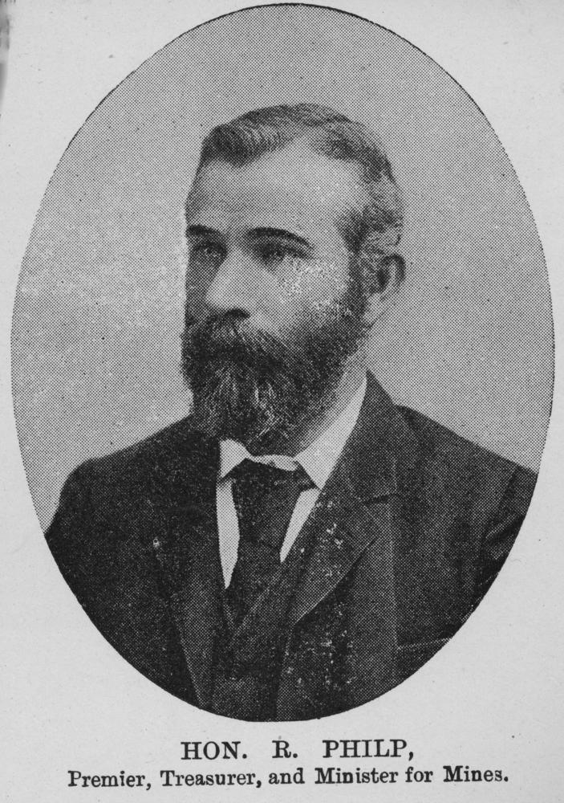
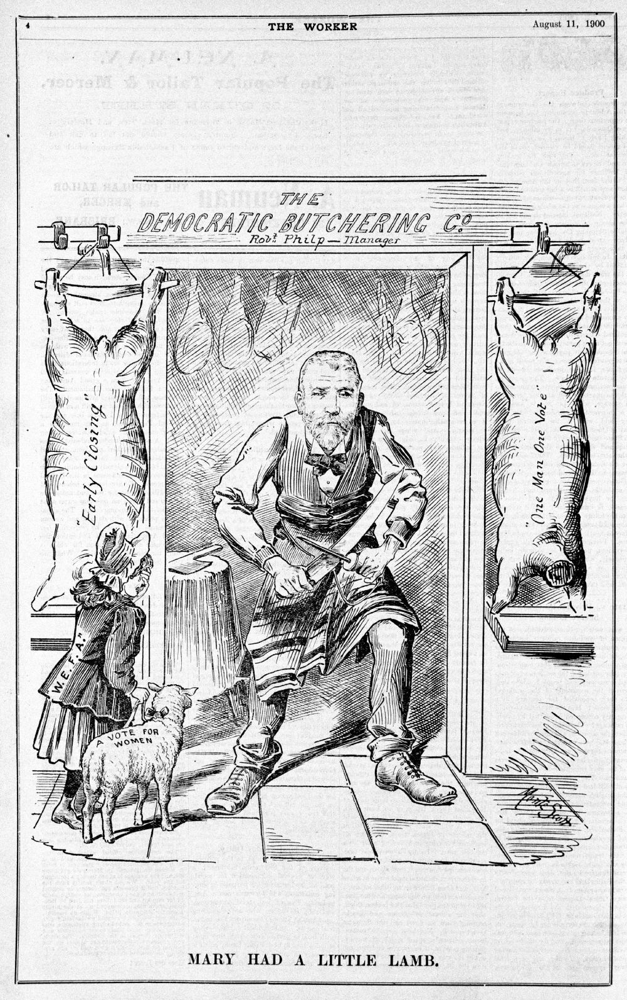

## Sir Robert Philp <small>(14‑23‑10)</small>

Sir Robert Philp was born on 28 December 1851 at Glasgow, Scotland, son of John Philp, lime kiln operator, and his wife Mary Ann (née Wylie). The family settled in Brisbane in 1862. After leaving school, young Robert joined the business of Sir James Burns at the northern goldfields port of Townsville in 1874, becoming a partner in the business in 1876. The Burns Philp partership flourished. 

Philp entered politics on 5 January 1876 by winning the seat of Musgrave, but transferred to the seat of Townsville on 12 May 1888 and held it until his defeat in 1915. On 7 December 1899, Philp became a reluctant Premier following the defeat of Anderson Dawson's short-lived Labor ministry. In 1901 the Philp Government presented an Adult Suffrage Bill, later shelved, that not only discriminated against women, it also discriminated against many males. 

Sir Robert died after an operation on 17 June 1922 in Holyrood Private Hospital, Brisbane, and was buried in Toowong Cemetery two days later. 

{ width="44.85%" }  { width="40%" }  

*<small>[Sir Robert Philp](http://onesearch.slq.qld.gov.au/permalink/f/1upgmng/slq_digitool194435), 1901 — State Library of Queensland.</small>*  
*<small>[Mary had a little lamb](http://onesearch.slq.qld.gov.au/permalink/f/1upgmng/slq_digitool191215), from the Worker, 11 August 1900 — State Library of Queensland.</small>* 
