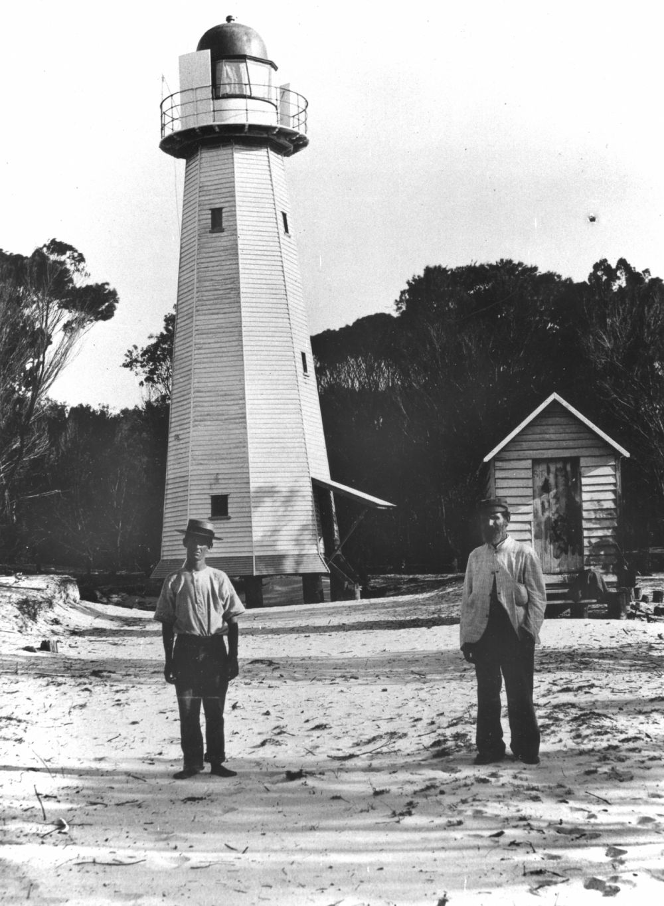

## Samuel James Reilly <small>(20‑46‑18)</small>

Samuel Crouch, born in Middlesex, was the son of Stephen Crouch and Mary Ann (née Reeves). At the age of 19, he became an Able Seaman. He assumed the surname 'Riley' and later 'Reilly' when he went to sea. He first arrived in Sydney in 1864 as a crewman on a ship before settling in Queensland in 1869. In December 1875, he was appointed to the Queensland Lighthouse Service as coxswain of the pilot boat and Receiving Officer at Inskip Point. Samuel died on 21 October 1919 aged 80 while stationed at Comboyuro Point Lighthouse.

{ width="40%" }

*<small>[Lighthouse at Comboyuro Point, Moreton Island, 1906](http://onesearch.slq.qld.gov.au/permalink/f/1upgmng/slq_alma21249691560002061). The two gentlemen standing in front of the lighthouse are Samuel James Reilly and his son James Compton Reilly. (Description supplied with photograph) - State Library of Queensland </small>*
