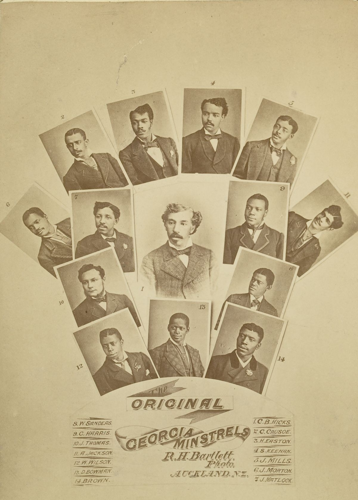

## Samuel Keenan <small>(2‑48‑7)</small>

New York‑born Samuel Keenan, was an original member of the all African‑American minstrel troupe who toured extensively throughout New Zealand, Australia with the Original Georgia Minstrels, beginning 1877 through to mid 1880s and were managed by Charles B. Hicks. The Georgia Minstrels performed to packed houses around the colonies (Victoria, NSW, South Australia, Tasmania and Queensland) in halls and in legitimate theatres including Gaiety, Tivoli, St Georges Hall and Theatre Royal. They always drew loud applause, laughter and calls for encores. 

Sam‘s name was familiar in all the principles theatres in Australia. He held a prominent place in numerous successful minstrel companies and in his particular line of entertainment he has probably never been equalled in Australia for the originality and humour of his portrayal of “negro minstrel” parts. Sam married a local girl Marian Collier and has an extremely proud extended family. Samuel Keenan died aged 40.

{ width="40%" }  

*<small>["Original Georgia Minstrels" composite image with founder Charles Hicks at center](https://en.wikipedia.org/wiki/Brooker_and_Clayton%27s_Georgia_Minstrels) - State Library of Queensland </small>* 
