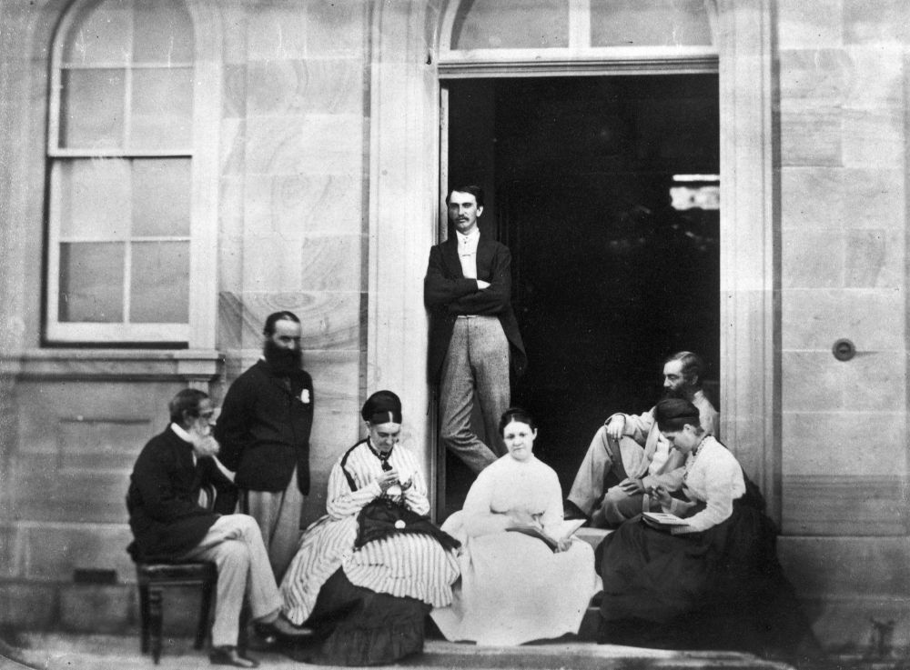

## Colonel Samuel Wensley Blackall <small>(Mount Blackall)</small>

Governor - 14 August 1868 to 2 January 1871

Blackall was born on 1 May 1809 in Dublin, son of Major Robert Blackall of the East India Company Army, and his wife Catherine, née Lewis. A member of a prosperous Irish family, he was educated by a private tutor and at fifteen went to Trinity College, Dublin, but did not graduate. After a military career, Blackall became Lieutenant-Governor of Dominica in 1851‑57; Governor of Sierra Leone in 1862, and in 1865 became Governor‑in‑chief of the West African Settlements. 

In 1868 he was appointed Governor of Queensland. On arrival Blackall was met by a tremendous popular welcome, but at once was plunged into a constitutional crisis, which had been temporarily held in check by the Administrator, Sir Maurice O'Connell. After a deadlock in the Legislative Assembly the Liberals had been defeated in an election but were petitioning the Governor to dissolve the assembly on the ground that it did not properly represent the colony. Blackall pursued a strictly constitutional course and refused to intervene directly. Despite the bitterness of the constitutional battle Blackall made no personal enemies. Willing to assist any genuine public cause, he made frequent appearances at public events, often accompanied by Mrs Terry, the wife of his private secretary Lieutenant Frederick Terry. 

By October 1870 Blackall's health was deteriorating. He requested that his funeral be such “as could be attended by even the humblest”. On 2 January 1871, he died and was buried the next day with as much pomp and ceremony as could be mustered at such short notice.

{ width="61.55%" }  { width="34%" }

*<small>[Colonel Blackall, Governor of Queensland, with his family](http://onesearch.slq.qld.gov.au/permalink/f/1upgmng/slq_alma21218698200002061) - State Library of Queensland </small>*
