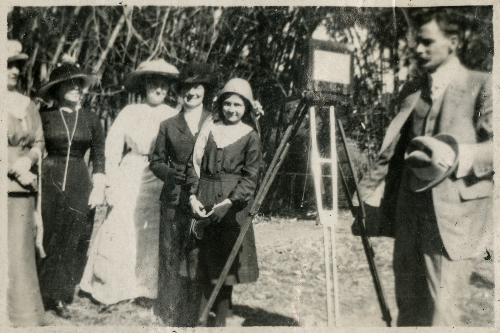

## Sidney Cook <small>[(4‑35‑14)](https://brisbane.discovereverafter.com/profile/31799328 "Go to Memorial Information" )</small>

Ex‑Salvation Army Limelight cameraman, Sid Cook, worked extensively with Henry Mobsby. The Limelight Department formed Australia's first registered film production company producing commissioned work for external agencies. Sidney Cook, was the second camera operator. The Royal Visit to Australasia in mid‑1901 included some of Sidney Cook's first camerawork, his coverage of the future [King George the Fifth ‑ laying the foundation stone of the Boer War monument in Ballarat](https://youtu.be/xQz7FSPrhBM?si=-Jupt8gfCa3IJkvd) on the 13th of May 1901. Sid Cook also filmed the Royal Couple's departure for Brisbane. They had been scheduled to go by sea, but an outbreak of bubonic plague in the Port of Brisbane changed their plans. 

Sid Cook’s family was growing and in July 1905 he made a move from the meagre salary of a Salvation Army officer to become a commercial film showman. Based in Queensland, Cook became the most prolific Australian filmmaker of the Edwardian era. He hired Brisbane's His Majesty's Theatre for the Christmas season in 1906 and the program included his startling films of Brisbane’s main thoroughfares shot from a moving tram. In 1908 Cook took the film to London on behalf of the Queensland Government for screening at the Franco‑British Exhibition. Compiling it together with other Brisbane scenes, in 1911 [Cook advertised it as part of his documentary Living Brisbane](https://trove.nla.gov.au/newspaper/article/19690464?searchTerm=cook). 

{ width="49%" } 

*<small>[Sidney Cook next to the camera with a group of five women Sydney 1913](https://onesearch.slq.qld.gov.au/permalink/61SLQ_INST/1dejkfd/alma99184002067002061) — State Library of Queensland.</small>*  

[Tasmania the Wonderland](https://www.nfsa.gov.au/latest/tasmanian-tiger-last-known-footage-thylacine) was probably filmed by Sidney and shows the last captive thylacine at the long-defunct Beaumaris Zoo in Hobart. 

<iframe width="560" height="315" src="https://www.youtube.com/embed/o79vefZC-aQ?si=IkwfKd3T6lbjAvSe" title="YouTube video player" frameborder="0" allow="accelerometer; autoplay; clipboard-write; encrypted-media; gyroscope; picture-in-picture; web-share" referrerpolicy="strict-origin-when-cross-origin" allowfullscreen></iframe>

