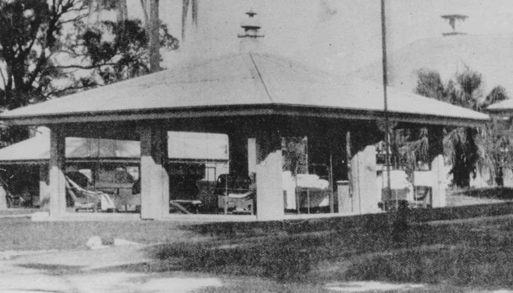

## Susannah Josephine McGann <small>(15‑31‑16)</small>

Sister Susannah McGann, daughter of John and Susannah McGann, was a member of the New Zealand Army Nursing Service. She had trained in Maryborough, obtaining both General Nursing and Obstetric Certificates. Susannah was on the staff of the Diamantina Hospital in 1908 and was on the ANTA register in 1923. She died on 10 June 1925 aged 46.

{ width="70%" }  

*<small>[Open air pavilions at Brisbane's Diamantina Hospital, 1920s](http://onesearch.slq.qld.gov.au/permalink/f/1upgmng/slq_alma21218621420002061) — State Library of Queensland.</small>*
