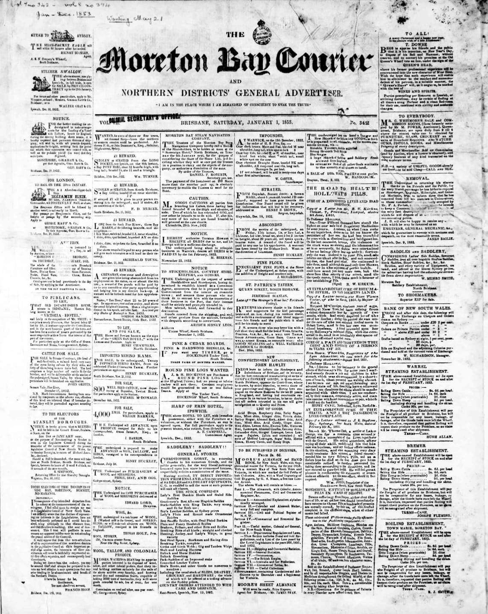

## Sylvester Doig <small>(1‑22‑9)</small>

One of the early newspaper editors in Moreton Bay, Scottish-born Sylvester came to the colony soon after it was opened to free settlers in 1842. In 1853-54 he edited the *Moreton Bay Free Press* and took an active part in community life in the early years of the colony. He also wrote a column for the *Sydney Morning Herald* in which he dismissed the call for separation from NSW as '[ridiculously premature](https://trove.nla.gov.au/newspaper/article/12952567?searchTerm=%22ridiculously%20premature%22)'. He died on 25 September 1884 while living in Leichhardt Street, Spring Hill. Unfortunately he destroyed most of his personal papers a couple of years before his death.

{ width="30%" }

<small>[The Moreton Bay Courier (Brisbane, Qld. : 1846 - 1861) 1 January 1853](https://trove.nla.gov.au/newspaper/page/542214) - National Library of Australia</small>
