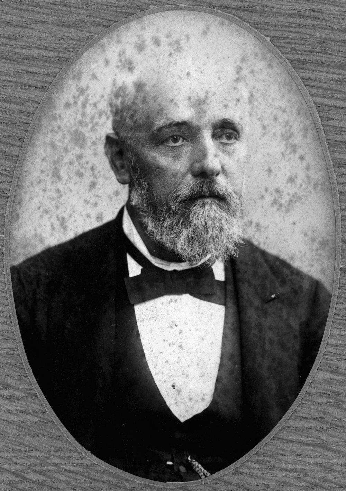

## Theodore Oscar Unmack <small>(13‑4‑12)</small>

German‑born Theodore Unmack (21 November 1835 ‑ 17 September 1919) arrived in Brisbane in 1860. He chaired a meeting at St. Andreas Lutheran Church in 1865 during a difficult time in the congregation. His first wife was Robina Bryce the daughter of John Bryce Glassford and Margaret Forsyth. She died on 10 September 1874 aged 39. The couple’s eldest son, Herbert Theodore died in Hamburg on 30 July 1869 aged 8 years and 8 months. 

Theodore’s second wife of 42 years, Kathleen died on 12 August 1937 aged 86 and was cremated in Sydney. She was the mother of six of his children. 

Theodore traded with his partner J. C. Heussler as a wholesale merchant and was the MLA for Toowong from 1888—1893 and Secretary for the Railways. He was a prominent Freemason who was buried with Presbyterian rites.

{ width="40%" }

*<small>[Unmack, Theodore, 1889](http://onesearch.slq.qld.gov.au/permalink/f/1upgmng/slq_alma21218162940002061) - State Library of Queensland. </small>*
